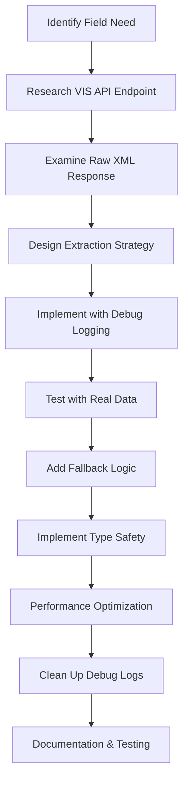

# Field Implementation Guidelines for VIS API Integration

## Overview

This document provides a comprehensive guide for developers adding new fields from VIS API calls to the BeachRef application. It's based on real implementation experience and addresses common pitfalls and best practices.

## Quick Reference Checklist

- [ ] Identify the VIS API endpoint and data location
- [ ] Understand the data format (seconds, strings, nested objects)
- [ ] Plan the extraction strategy (direct access vs. transformation)
- [ ] Implement with multiple fallback layers
- [ ] Add comprehensive debug logging
- [ ] Test with real API data
- [ ] Clean up debug logging after verification

## 1. Data Discovery Phase

### Step 1: Identify the VIS API Response Structure

**Example**: Adding duration fields from VIS API

1. **Find the correct API endpoint**
   - For match details: `GetBeachMatch` (individual match data)
   - For match lists: `GetBeachMatchList` (basic match data, limited fields)
   - For live data: `GetBeachLive` (real-time match updates)

2. **Examine the raw XML response**
   ```xml
   <BeachLive>
     <Match No="495295" Status="13" />
     <Set No="1" Duration="891" PointsTeamA="21" PointsTeamB="12" />
     <Set No="2" Duration="989" PointsTeamA="21" PointsTeamB="16" />
   </BeachLive>
   ```

3. **Document field characteristics**
   - **Location**: XML attributes vs. elements vs. nested structures
   - **Data type**: String numbers, integers, formatted strings
   - **Units**: Seconds, minutes, formatted time strings
   - **Availability**: Always present vs. conditional vs. match-status dependent

## 2. Data Extraction Strategy

### Choose Your Extraction Approach

**Option A: Enhanced Match Data (Recommended)**
```typescript
// Uses VisApiIntegrationService to call GetBeachMatch for each match
const result = await integrationService.getMatchesWithEnhancedData(
  { tournamentNo },
  {
    includeSetScores: true,
    includeStatistics: true,
    parallel: true
  }
);

// Access fields directly from enhanced data
const duration = (match as any).Duration; // Raw XML attribute preserved
```

**Option B: Direct Service Enhancement**
```typescript
// Enhance existing matches with additional API calls
const enhanced = await setScoreService.enhanceMatchesWithSetScores(matches);
```

**Option C: Real-time Data Integration**
```typescript
// For live updates during matches
const liveData = await visApiClient.getBeachLive({ matchNo, tournamentNo });
```

## 3. Implementation Pattern

### Step 1: Add Debug Logging First

Always start with comprehensive logging to understand the actual data structure:

```typescript
const extractField = (match: ExtendedBeachMatch): string | null => {
  // DEBUG: Log the complete data structure
  console.log('Field extraction debug:', {
    matchId: match.id,
    availableFields: Object.keys(match).filter(key => key.toLowerCase().includes('duration')),
    // Test various possible field names
    Duration: (match as any).Duration,
    duration: (match as any).duration,
    totalDuration: (match as any).totalDuration,
    DurationSet1: (match as any).DurationSet1,
    DurationSet2: (match as any).DurationSet2
  });
  
  // Implementation continues...
};
```

### Step 2: Implement Multiple Fallback Layers

Create a robust extraction function with multiple fallback strategies:

```typescript
const extractDuration = (match: ExtendedBeachMatch): string | null => {
  // PRIMARY: Use direct field from enhanced data (VIS XML attribute)
  const totalDurationSeconds = (match as any).Duration;
  if (totalDurationSeconds) {
    return convertSecondsToDisplayFormat(parseInt(totalDurationSeconds));
  }

  // FALLBACK 1: Calculate from individual components
  const set1Duration = (match as any).DurationSet1;
  const set2Duration = (match as any).DurationSet2;
  const set3Duration = (match as any).DurationSet3;
  
  if (set1Duration || set2Duration || set3Duration) {
    const totalSeconds = (parseInt(set1Duration || '0') + 
                         parseInt(set2Duration || '0') + 
                         parseInt(set3Duration || '0'));
    if (totalSeconds > 0) {
      return convertSecondsToDisplayFormat(totalSeconds);
    }
  }

  // FALLBACK 2: Use existing match result data
  if (match.result?.duration && typeof match.result.duration === 'number') {
    return convertMinutesToDisplayFormat(match.result.duration);
  }

  // FALLBACK 3: Legacy support
  return legacyDurationExtraction(match);
};
```

### Step 3: Data Conversion Utilities

Create reusable conversion functions:

```typescript
const convertSecondsToDisplayFormat = (seconds: number): string => {
  const totalMinutes = Math.floor(seconds / 60);
  const hours = Math.floor(totalMinutes / 60);
  const minutes = totalMinutes % 60;
  
  if (hours > 0) {
    return `${hours}h ${minutes}m`;
  } else {
    return `${minutes}m`;
  }
};

const convertMinutesToDisplayFormat = (minutes: number): string => {
  const hours = Math.floor(minutes / 60);
  const remainingMinutes = minutes % 60;
  
  if (hours > 0) {
    return `${hours}h ${remainingMinutes}m`;
  } else {
    return `${remainingMinutes}m`;
  }
};
```

## 4. Common Data Patterns

### VIS API Field Naming Conventions

**Duration Fields**:
- `Duration`: Total match duration (seconds)
- `DurationSet1`, `DurationSet2`, `DurationSet3`: Individual set durations (seconds)
- `StartTime`, `EndTime`: Match timing (formatted strings)

**Team Fields**:
- `TeamAFederationCode`, `TeamBFederationCode`: Country/federation codes
- `TeamAPlayer1Name`, `TeamAPlayer2Name`: Individual player names
- `NoPlayer1`, `NoPlayer2`: VIS player numbers
- `NoShirt1`, `NoShirt2`: Jersey numbers

**Match Fields**:
- `No`: Match number (VIS identifier)
- `Status`: Match status code (numeric)
- `MatchPointsA`, `MatchPointsB`: Match points (sets won)
- `ResultType`: Match result classification

### XML Structure Patterns

```xml
<!-- Flat attributes (most common) -->
<Match Duration="1880" Status="13" />

<!-- Nested elements -->
<Match>
  <Team Name="Player1/Player2" FederationCode="USA" />
  <Sets>
    <Set No="1" Duration="891" PointsTeamA="21" />
  </Sets>
</Match>

<!-- Mixed structure -->
<BeachLive>
  <Tournament Code="MHAM2025" Name="Tournament Name" />
  <Match No="495295" Status="13" />
  <Team FederationCode="NOR" Name="Mol, A./Sørum, C." />
  <Set Duration="891" PointsTeamA="21" />
</BeachLive>
```

## 5. Error Handling & Edge Cases

### Handle Missing or Invalid Data

```typescript
const safeExtractField = (match: ExtendedBeachMatch, fieldName: string): string | null => {
  try {
    const value = (match as any)[fieldName];
    
    // Check for existence
    if (!value) return null;
    
    // Validate data type
    if (typeof value !== 'string' && typeof value !== 'number') return null;
    
    // Validate content
    if (typeof value === 'string' && value.trim() === '') return null;
    if (typeof value === 'number' && (isNaN(value) || value < 0)) return null;
    
    return value.toString();
  } catch (error) {
    console.warn(`Failed to extract ${fieldName}:`, error);
    return null;
  }
};
```

### Match Status Considerations

Different match statuses may have different data availability:

```typescript
const isDataAvailableForStatus = (match: ExtendedBeachMatch, fieldName: string): boolean => {
  switch (fieldName) {
    case 'Duration':
    case 'DurationSet1':
      // Duration only available for completed or in-progress matches
      return match.status === MatchStatus.FINISHED || match.status === MatchStatus.RUNNING;
    
    case 'FinalScore':
      // Final score only for completed matches
      return match.status === MatchStatus.FINISHED;
    
    default:
      return true;
  }
};
```

## 6. TypeScript Integration

### Extend Types Properly

```typescript
// Add fields to the extended match type
type ExtendedBeachMatch = BeachMatchCore & {
  // VIS API direct fields (preserve original casing)
  Duration?: string;
  DurationSet1?: string;
  DurationSet2?: string;
  DurationSet3?: string;
  
  // Computed/transformed fields
  formattedDuration?: string;
  totalSetCount?: number;
  
  // XML source for debugging
  __sourceXml?: string;
};
```

### Type-Safe Field Access

```typescript
// Helper for type-safe field access
const getVISField = <T = string>(
  match: ExtendedBeachMatch, 
  fieldName: string, 
  defaultValue: T | null = null
): T | null => {
  const value = (match as any)[fieldName];
  return value !== undefined ? value : defaultValue;
};

// Usage
const duration = getVISField(match, 'Duration');
const setDuration = getVISField(match, 'DurationSet1');
```

## 7. Testing Strategy

### Test with Real API Data

```typescript
// Always test with actual VIS API responses
const testFieldExtraction = async () => {
  const testTournamentNo = '1552'; // Use real tournament
  const testMatchNo = '495295';    // Use real match
  
  const result = await integrationService.getMatchesWithEnhancedData(
    { tournamentNo: testTournamentNo }
  );
  
  result.matches.forEach((match, index) => {
    console.log(`Match ${index}:`, {
      id: match.id,
      extractedField: extractNewField(match),
      rawFieldValue: (match as any).NewFieldName,
      isFieldAvailable: !!(match as any).NewFieldName
    });
  });
};
```

### Edge Case Testing

```typescript
const testEdgeCases = () => {
  const testCases = [
    { Duration: '0', expected: null },      // Zero duration
    { Duration: '', expected: null },       // Empty string
    { Duration: 'invalid', expected: null }, // Invalid format
    { Duration: '1880', expected: '31m' },   // Normal case
    { DurationSet1: '891', DurationSet2: '989', expected: '31m' }, // Calculated
  ];
  
  testCases.forEach((testCase, index) => {
    const mockMatch = { ...baseMockMatch, ...testCase };
    const result = extractDuration(mockMatch);
    console.log(`Test ${index}: ${result === testCase.expected ? '✅' : '❌'}`);
  });
};
```

## 8. Performance Considerations

### Minimize API Calls

```typescript
// GOOD: Batch processing with parallel calls
const enhancedResult = await integrationService.getMatchesWithEnhancedData(
  { tournamentNo },
  { parallel: true }
);

// AVOID: Individual calls per match
for (const match of matches) {
  const individualResult = await apiClient.getBeachMatch({ matchNo: match.id });
}
```

### Cache Heavy Computations

```typescript
// Cache expensive field transformations
const fieldCache = new Map<string, string>();

const getCachedField = (match: ExtendedBeachMatch, extractor: Function): string | null => {
  const cacheKey = `${match.id}_${extractor.name}`;
  
  if (fieldCache.has(cacheKey)) {
    return fieldCache.get(cacheKey)!;
  }
  
  const result = extractor(match);
  if (result) {
    fieldCache.set(cacheKey, result);
  }
  
  return result;
};
```

## 9. Debug and Maintenance

### Structured Debug Logging

```typescript
const debugFieldExtraction = (match: ExtendedBeachMatch, fieldName: string) => {
  // Only log for specific matches to avoid spam
  if (!match.id.includes('DEBUG_MATCH_ID')) return;
  
  console.log(`🔍 Field extraction: ${fieldName}`, {
    matchId: match.id,
    status: match.status,
    availableFields: Object.keys(match).filter(key => 
      key.toLowerCase().includes(fieldName.toLowerCase())
    ),
    fieldValue: (match as any)[fieldName],
    fieldType: typeof (match as any)[fieldName],
    hasSourceXml: !!(match as any).__sourceXml
  });
};
```

### XML Inspection Utilities

```typescript
const inspectXMLStructure = (xmlString: string, targetField: string) => {
  try {
    const parser = new DOMParser();
    const xmlDoc = parser.parseFromString(xmlString, 'text/xml');
    const allElements = xmlDoc.getElementsByTagName('*');
    
    console.log(`🔍 XML structure for ${targetField}:`);
    for (let i = 0; i < allElements.length; i++) {
      const element = allElements[i];
      const attributes = Array.from(element.attributes);
      
      attributes.forEach(attr => {
        if (attr.name.toLowerCase().includes(targetField.toLowerCase())) {
          console.log(`Found in ${element.tagName}.${attr.name}: "${attr.value}"`);
        }
      });
    }
  } catch (error) {
    console.error('XML inspection failed:', error);
  }
};
```

## 10. Common Pitfalls and Solutions

### Pitfall 1: Case Sensitivity
❌ **Wrong**: Looking for `duration` when field is `Duration`
✅ **Right**: Check actual field names in debug logs first

### Pitfall 2: Data Type Assumptions
❌ **Wrong**: Assuming numeric fields are numbers
✅ **Right**: VIS API returns everything as strings, convert as needed

### Pitfall 3: Missing Fallback Logic
❌ **Wrong**: Only checking one possible field location
✅ **Right**: Implement multiple fallback strategies

### Pitfall 4: Ignoring Match Status
❌ **Wrong**: Expecting all fields to be available for all matches
✅ **Right**: Check match status and field availability

### Pitfall 5: Debug Logging Spam
❌ **Wrong**: Logging every match extraction in production
✅ **Right**: Conditional logging for specific matches or debug mode

## 11. Field Integration Workflow



## Conclusion

Following these guidelines ensures robust, maintainable field extraction from VIS API data. The key principles are:

1. **Start with comprehensive debugging** to understand the actual data structure
2. **Implement multiple fallback layers** for reliability
3. **Handle edge cases and errors gracefully**
4. **Use TypeScript for type safety**
5. **Test with real API data**
6. **Clean up debug logging after implementation**
7. **Document the extraction logic for future developers**

This approach minimizes debugging time and creates robust integrations that handle real-world API variations and edge cases.