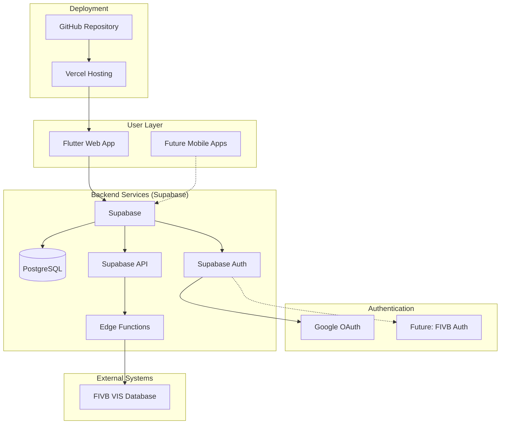
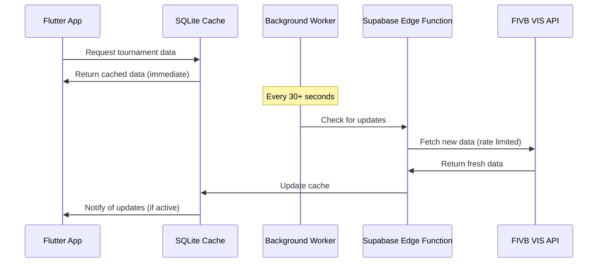
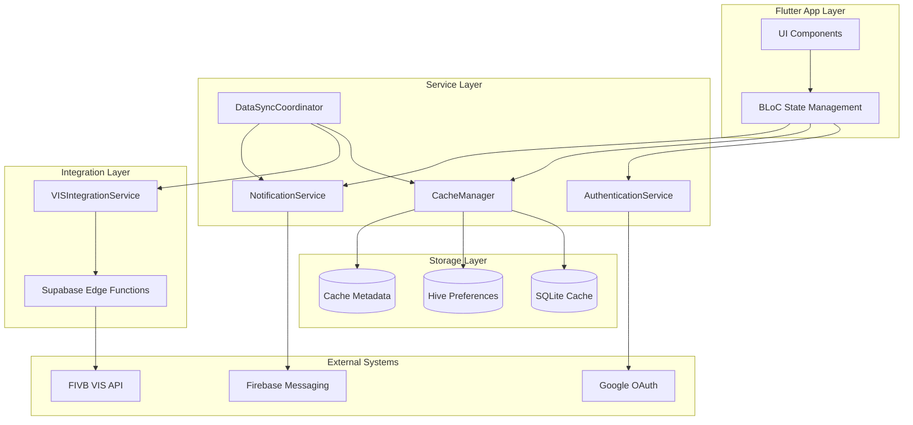
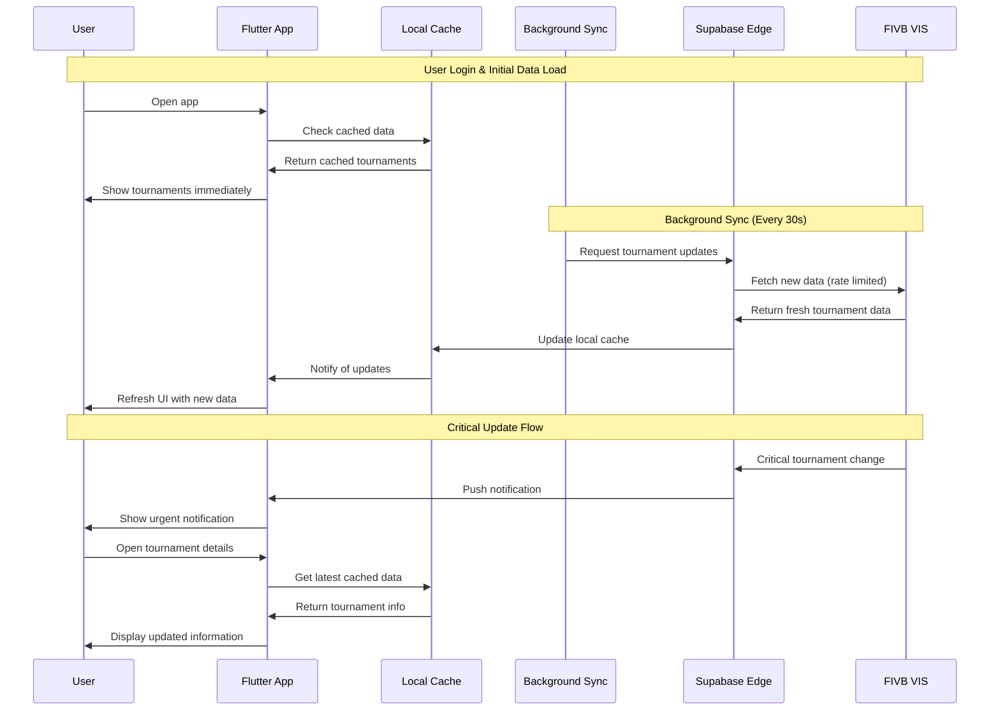

# BeachRef Architecture Document

## Introduction

This document outlines the overall project architecture for **BeachRef**, including backend systems, shared services, and non-UI specific concerns. Its primary goal is to serve as the guiding architectural blueprint for AI-driven development, ensuring consistency and adherence to chosen patterns and technologies.

**Relationship to Frontend Architecture:**
If the project includes a significant user interface, a separate Frontend Architecture Document will detail the frontend-specific design and MUST be used in conjunction with this document. Core technology stack choices documented herein (see "Tech Stack") are definitive for the entire project, including any frontend components.

### Starter Template or Existing Project

**Decision:** From scratch with Flutter Web + Supabase integration
- **No starter template** - Building custom Flutter application
- **Technology Stack:** Flutter Web, Supabase PostgreSQL, Vercel deployment
- **Repository Strategy:** Single Flutter project with web target, positioned for future mobile expansion
- **Deployment:** Automated GitHub → Vercel pipeline for Flutter web builds
- **Authentication:** Google Auth via Supabase for MVP, with future FIVB integration path

### Change Log
| Date | Version | Description | Author |
|------|---------|-------------|---------|
| 2025-07-26 | 1.0 | Initial architecture with Flutter/Supabase stack | BMad Master |
| 2025-07-26 | 1.1 | Added Google Auth via Supabase for MVP | BMad Master |

## High Level Architecture

### Technical Summary

BeachRef employs a **modern Flutter-first architecture** with Supabase as the backend-as-a-service provider. The system follows a **client-centric pattern** where Flutter handles all UI logic and state management, while Supabase provides database, authentication, and real-time capabilities. Authentication starts with **Google Auth via Supabase** for rapid MVP deployment, with a designed upgrade path to FIVB credential integration. The architecture is designed for **cross-platform scalability** - starting with Flutter Web deployed on Vercel, with a clear path to iOS/Android mobile apps using the same codebase and backend infrastructure.

### High Level Overview

1. **Architectural Style:** Client-Server with BaaS (Backend-as-a-Service)
2. **Repository Structure:** Monorepo - Single Flutter project with web/mobile targets
3. **Service Architecture:** Flutter client + Supabase backend services
4. **Primary User Flow:** User authenticates via Google → Flutter app queries Supabase → Real-time data sync with VIS integration via Edge Functions
5. **Key Decisions:** 
   - Flutter Web for immediate deployment, mobile-ready architecture
   - Supabase for rapid backend development and scaling
   - Google Auth for MVP with FIVB integration roadmap
   - Vercel for optimized Flutter Web hosting

### High Level Project Diagram



### Architectural and Design Patterns

- **BLoC Pattern (Business Logic Component):** Flutter state management for complex UI state and business logic separation - _Rationale:_ Industry standard for Flutter, enables testability and clear separation of concerns
- **Repository Pattern:** Abstract data access through Supabase client - _Rationale:_ Enables testing, future backend flexibility, and clean API boundaries  
- **Provider Pattern:** Dependency injection for services and state management - _Rationale:_ Flutter's recommended approach for dependency management and state sharing
- **Event-Driven Updates:** Real-time data synchronization using Supabase subscriptions - _Rationale:_ Keeps referee data current during tournaments without manual refresh
- **OAuth2 + JWT Pattern:** Google authentication with Supabase JWT tokens - _Rationale:_ Secure, scalable authentication with smooth upgrade path to FIVB integration
- **Cache-First Architecture:** Local SQLite caching with 30+ second background sync intervals - _Rationale:_ VIS API rate limiting requires intelligent caching to ensure data availability during gaps
- **Background Sync Pattern:** Scheduled data fetching with priority queuing - _Rationale:_ Respects API limits while maintaining fresh data for critical referee workflows

## Tech Stack

This is the **DEFINITIVE** technology selection for BeachRef. These choices will guide all development decisions and must be referenced by all team members and AI agents.

**Critical Constraint:** VIS API calls limited to ~30 second intervals - architecture designed for cache-first operations.

### Cloud Infrastructure
- **Primary Provider:** Supabase (Database, Auth, API, Edge Functions)
- **Web Hosting:** Vercel 
- **Key Services:** Supabase PostgreSQL, Supabase Auth, Supabase Edge Functions
- **Deployment Regions:** Global CDN via Vercel, Database in closest Supabase region

### Technology Stack Table

| Category | Technology | Version | Purpose | Rationale |
|----------|------------|---------|---------|-----------|
| **Language** | Dart | 3.2.0+ | Primary development language | Flutter's native language, cross-platform capability |
| **Framework** | Flutter | 3.16.0+ | Frontend framework | Cross-platform web/mobile, single codebase |
| **Backend Service** | Supabase | Latest | Database, Auth, API, Edge Functions | Rapid development, PostgreSQL, real-time capabilities |
| **Database** | PostgreSQL | 15+ (via Supabase) | Primary data storage | Relational data, FIVB integration requirements |
| **Local Cache** | sqflite | 2.3.0+ | Local SQLite caching | Essential for 30s API gaps, offline capability |
| **Key-Value Store** | hive | 2.2.3+ | Session & preference storage | Fast local storage, user settings |
| **Authentication** | Supabase Auth + Google OAuth | Latest | User authentication | Easy setup, secure, future FIVB integration path |
| **State Management** | flutter_bloc | 8.1.0+ | Application state management | Industry standard, testable, scalable |
| **HTTP Client** | supabase_flutter | 2.0.0+ | API communication | Official Supabase client, real-time subscriptions |
| **Background Tasks** | workmanager | 0.5.0+ | Scheduled sync operations | Critical for respecting 30s API limits |
| **Web Hosting** | Vercel | N/A | Flutter Web deployment | Optimized for static sites, GitHub integration |
| **Edge Functions** | Supabase Edge Functions | Latest | VIS API integration & rate limiting | Server-side logic, API proxying, data transformation |
| **Development Tools** | Flutter SDK + VS Code | Latest | Development environment | Official tooling, excellent debugging |

## Caching Architecture Strategy

**Critical Design Principle:** The application MUST function seamlessly during 30+ second API call gaps.

### Cache Hierarchy
1. **L1 Cache (Memory):** BLoC state management for active session data
2. **L2 Cache (Local SQLite):** Persistent tournament/match data via sqflite  
3. **L3 Cache (Key-Value):** User preferences and session data via Hive
4. **L4 Source (Remote):** Supabase + VIS integration with rate limiting

### Background Sync Strategy


### Data Freshness Management
- **Tournament Lists:** 30-60 second refresh cycle
- **Match Results:** Priority refresh for bookmarked tournaments  
- **Referee Assignments:** High-priority, immediate cache update
- **User Preferences:** Local-first, sync on background

### Offline-First Approach
- **Full Functionality:** App works completely offline with cached data
- **Graceful Degradation:** Clear indicators when data may be stale
- **Smart Prefetching:** Background worker prioritizes user's bookmarked tournaments
- **Conflict Resolution:** Last-write-wins for user preferences, server authority for tournament data

**Critical Updates Exception:** Negotiate faster refresh intervals for urgent tournament changes with push notification support.

## Data Models

### Tournament
**Purpose:** Core entity representing beach volleyball tournaments from VIS database

**Key Attributes:**
- id: String - Unique VIS tournament identifier
- name: String - Tournament name and title
- location: String - Venue location and address
- startDate: DateTime - Tournament start date/time
- endDate: DateTime - Tournament end date/time  
- competitionLevel: String - Professional level (World Tour, Continental, etc.)
- tournamentType: String - Tournament format (Main Draw, Qualifier, etc.)
- status: String - Current status (Upcoming, Live, Completed)
- teams: List<Team> - Participating teams
- lastUpdated: DateTime - Cache timestamp for sync management

**Relationships:**
- Has many Match entities
- Has many RefereeAssignment entities
- Referenced by UserBookmark entities

### Match
**Purpose:** Individual match within tournaments with results and statistics

**Key Attributes:**
- id: String - Unique VIS match identifier
- tournamentId: String - Parent tournament reference
- matchNumber: int - Match sequence number
- scheduledTime: DateTime - Planned match start time
- actualStartTime: DateTime? - Actual start time if available
- duration: Duration? - Match duration if completed
- court: String - Court assignment
- status: String - Match status (Scheduled, Live, Completed)
- team1: Team - First competing team
- team2: Team - Second competing team
- finalScore: Score? - Final match score if completed
- setScores: List<Score> - Individual set scores
- statistics: MatchStatistics? - Detailed match stats
- lastUpdated: DateTime - Cache sync timestamp

**Relationships:**
- Belongs to Tournament entity
- Has many RefereeAssignment entities
- Referenced by MatchStatistics entity

### RefereeAssignment
**Purpose:** Referee assignments to tournaments and specific matches

**Key Attributes:**
- id: String - Unique assignment identifier
- refereeId: String - FIVB referee identifier
- refereeName: String - Referee full name
- refereeLevel: String - Certification level
- tournamentId: String - Assigned tournament
- matchId: String? - Specific match assignment if applicable
- role: String - Referee role (First Referee, Second Referee, etc.)
- assignmentDate: DateTime - When assignment was made
- status: String - Assignment status (Confirmed, Pending, Cancelled)
- lastUpdated: DateTime - Cache sync timestamp

**Relationships:**
- Belongs to Tournament entity
- Optionally belongs to Match entity
- Referenced by UserProfile for personal assignments

### UserProfile
**Purpose:** Local user data and preferences for personalized experience

**Key Attributes:**
- userId: String - Google Auth user ID
- email: String - User email address
- displayName: String - User display name
- preferredLocation: String? - Default location filter
- preferredCompetitionLevels: List<String> - Favorite competition types
- timezone: String - User timezone for date display
- notificationPreferences: NotificationSettings - Push notification settings
- createdAt: DateTime - Account creation timestamp
- lastLoginAt: DateTime - Last app access time

**Relationships:**
- Has many UserBookmark entities
- Has notification preferences configuration

### UserBookmark
**Purpose:** User's saved tournaments for quick access and priority sync

**Key Attributes:**
- id: String - Unique bookmark identifier
- userId: String - Owner user ID
- tournamentId: String - Bookmarked tournament
- bookmarkedAt: DateTime - When bookmark was created
- notes: String? - User's personal notes about tournament
- reminderEnabled: bool - Whether to send notifications
- syncPriority: int - Priority level for background sync (1-5)

**Relationships:**
- Belongs to UserProfile entity
- References Tournament entity

### CacheMetadata
**Purpose:** Track data freshness and sync status for intelligent caching

**Key Attributes:**
- entityType: String - Type of cached entity (Tournament, Match, etc.)
- entityId: String - Specific entity identifier
- lastSyncAttempt: DateTime - Last background sync attempt
- lastSuccessfulSync: DateTime - Last successful data update
- syncStatus: String - Current sync status (Fresh, Stale, Failed)
- retryCount: int - Failed sync retry attempts
- nextSyncScheduled: DateTime - When next sync is planned
- priority: int - Sync priority based on user behavior

**Relationships:**
- References all cached entities for sync management

## Components

### VISIntegrationService
**Responsibility:** Manages all FIVB VIS API communication with rate limiting and error handling

**Key Interfaces:**
- fetchTournaments(filters): Future<List<Tournament>>
- fetchMatchResults(tournamentId): Future<List<Match>>
- fetchRefereeAssignments(tournamentId): Future<List<RefereeAssignment>>

**Dependencies:** Supabase Edge Functions, rate limiting controller, error retry logic

**Technology Stack:** Supabase Edge Functions (TypeScript), rate limiting middleware, VIS API client

### CacheManager
**Responsibility:** Handles all local data storage, sync coordination, and cache invalidation

**Key Interfaces:**
- getCachedTournaments(filters): List<Tournament>
- updateCache(data): Future<void>
- scheduleSync(priority): Future<void>

**Dependencies:** SQLite database, background sync worker, cache metadata tracker

**Technology Stack:** sqflite for local storage, workmanager for background tasks, Hive for preferences

### AuthenticationService
**Responsibility:** Google OAuth integration via Supabase Auth with session management

**Key Interfaces:**
- signInWithGoogle(): Future<UserProfile>
- getCurrentUser(): UserProfile?
- signOut(): Future<void>

**Dependencies:** Supabase Auth, Google OAuth provider, local session storage

**Technology Stack:** supabase_flutter auth, google_sign_in package, secure storage

### NotificationService
**Responsibility:** Push notifications for critical tournament updates and user reminders

**Key Interfaces:**
- sendTournamentUpdate(tournamentId, message): Future<void>
- scheduleReminder(bookmark): Future<void>
- registerForPushNotifications(): Future<void>

**Dependencies:** Firebase Cloud Messaging, Supabase real-time subscriptions, user preferences

**Technology Stack:** firebase_messaging, flutter_local_notifications, background sync triggers

### DataSyncCoordinator
**Responsibility:** Orchestrates background data synchronization respecting API rate limits

**Key Interfaces:**
- coordinateSync(): Future<void>
- prioritizeUserBookmarks(): Future<void>
- handleSyncFailure(error): Future<void>

**Dependencies:** VIS Integration Service, Cache Manager, user bookmark priorities

**Technology Stack:** workmanager for scheduling, priority queue management, exponential backoff

### Component Diagrams



## External APIs

### FIVB VIS API
- **Purpose:** Official source for tournament, match, and referee data
- **Documentation:** Available via FIVB (specific URL needed)
- **Base URL(s):** TBD - requires FIVB coordination
- **Authentication:** API key or OAuth (requires negotiation)
- **Rate Limits:** ~30 seconds between calls (negotiable for critical updates)

**Key Endpoints Used:**
- `GET /tournaments` - Tournament listings with filters
- `GET /tournaments/{id}/matches` - Match data and results
- `GET /tournaments/{id}/referees` - Referee assignments
- `GET /matches/{id}/statistics` - Detailed match statistics

**Integration Notes:** All VIS calls routed through Supabase Edge Functions for rate limiting, caching, and error handling. Critical updates may negotiate faster refresh intervals.

### Google OAuth API
- **Purpose:** User authentication via Google accounts
- **Documentation:** https://developers.google.com/identity/protocols/oauth2
- **Base URL(s):** https://accounts.google.com/oauth/
- **Authentication:** OAuth 2.0 with Supabase integration
- **Rate Limits:** Standard Google API limits (generous for auth use case)

**Key Endpoints Used:**
- `POST /oauth2/token` - Exchange authorization code for tokens
- `GET /oauth2/userinfo` - Retrieve user profile information

**Integration Notes:** Handled via Supabase Auth provider, automatically manages token refresh and session persistence.

## Core Workflows



## Database Schema

```sql
-- Supabase PostgreSQL Schema
CREATE TABLE tournaments (
    id TEXT PRIMARY KEY,
    name TEXT NOT NULL,
    location TEXT NOT NULL,
    start_date TIMESTAMPTZ NOT NULL,
    end_date TIMESTAMPTZ NOT NULL,
    competition_level TEXT NOT NULL,
    tournament_type TEXT NOT NULL,
    status TEXT NOT NULL,
    teams JSONB,
    last_updated TIMESTAMPTZ DEFAULT NOW(),
    created_at TIMESTAMPTZ DEFAULT NOW()
);

CREATE TABLE matches (
    id TEXT PRIMARY KEY,
    tournament_id TEXT REFERENCES tournaments(id),
    match_number INTEGER NOT NULL,
    scheduled_time TIMESTAMPTZ NOT NULL,
    actual_start_time TIMESTAMPTZ,
    duration INTERVAL,
    court TEXT NOT NULL,
    status TEXT NOT NULL,
    team1 JSONB NOT NULL,
    team2 JSONB NOT NULL,
    final_score JSONB,
    set_scores JSONB,
    statistics JSONB,
    last_updated TIMESTAMPTZ DEFAULT NOW(),
    created_at TIMESTAMPTZ DEFAULT NOW()
);

CREATE TABLE referee_assignments (
    id TEXT PRIMARY KEY,
    referee_id TEXT NOT NULL,
    referee_name TEXT NOT NULL,
    referee_level TEXT NOT NULL,
    tournament_id TEXT REFERENCES tournaments(id),
    match_id TEXT REFERENCES matches(id),
    role TEXT NOT NULL,
    assignment_date TIMESTAMPTZ NOT NULL,
    status TEXT NOT NULL,
    last_updated TIMESTAMPTZ DEFAULT NOW(),
    created_at TIMESTAMPTZ DEFAULT NOW()
);

CREATE TABLE user_profiles (
    user_id TEXT PRIMARY KEY,
    email TEXT NOT NULL,
    display_name TEXT,
    preferred_location TEXT,
    preferred_competition_levels JSONB,
    timezone TEXT DEFAULT 'UTC',
    notification_preferences JSONB,
    created_at TIMESTAMPTZ DEFAULT NOW(),
    last_login_at TIMESTAMPTZ DEFAULT NOW()
);

CREATE TABLE user_bookmarks (
    id TEXT PRIMARY KEY DEFAULT gen_random_uuid(),
    user_id TEXT REFERENCES user_profiles(user_id),
    tournament_id TEXT REFERENCES tournaments(id),
    bookmarked_at TIMESTAMPTZ DEFAULT NOW(),
    notes TEXT,
    reminder_enabled BOOLEAN DEFAULT false,
    sync_priority INTEGER DEFAULT 3,
    UNIQUE(user_id, tournament_id)
);

-- Indexes for performance
CREATE INDEX idx_tournaments_dates ON tournaments(start_date, end_date);
CREATE INDEX idx_tournaments_location ON tournaments(location);
CREATE INDEX idx_matches_tournament ON matches(tournament_id);
CREATE INDEX idx_matches_schedule ON matches(scheduled_time);
CREATE INDEX idx_referee_assignments_tournament ON referee_assignments(tournament_id);
CREATE INDEX idx_user_bookmarks_user ON user_bookmarks(user_id);
```

## Source Tree

```
beachref/
├── lib/
│   ├── main.dart                          # App entry point
│   ├── app/
│   │   ├── app.dart                       # Main app configuration
│   │   ├── router.dart                    # Navigation routing
│   │   └── theme.dart                     # App theme and styling
│   ├── core/
│   │   ├── constants/                     # App constants
│   │   ├── errors/                        # Error classes
│   │   ├── network/                       # HTTP client setup
│   │   └── utils/                         # Utility functions
│   ├── data/
│   │   ├── datasources/
│   │   │   ├── local/                     # SQLite & Hive implementations
│   │   │   └── remote/                    # Supabase API clients
│   │   ├── models/                        # Data models
│   │   └── repositories/                  # Repository implementations
│   ├── domain/
│   │   ├── entities/                      # Business entities
│   │   ├── repositories/                  # Repository interfaces
│   │   └── usecases/                      # Business logic use cases
│   ├── presentation/
│   │   ├── bloc/                          # BLoC state management
│   │   ├── pages/                         # UI pages/screens
│   │   ├── widgets/                       # Reusable UI components
│   │   └── utils/                         # UI utilities
│   └── services/
│       ├── auth_service.dart              # Authentication service
│       ├── cache_manager.dart             # Cache management
│       ├── notification_service.dart      # Push notifications
│       ├── sync_coordinator.dart          # Background sync
│       └── vis_integration_service.dart   # VIS API integration
├── web/                                   # Flutter web specific files
├── supabase/
│   ├── functions/                         # Edge functions
│   │   ├── vis-integration/              # VIS API proxy
│   │   └── notification-handler/         # Push notification logic
│   └── migrations/                        # Database migrations
├── test/                                  # Unit and widget tests
├── integration_test/                      # Integration tests
├── pubspec.yaml                          # Dependencies
└── README.md                             # Project documentation
```

## Infrastructure and Deployment

### Infrastructure as Code
- **Tool:** Supabase CLI + Vercel CLI
- **Location:** `supabase/` directory for database, `vercel.json` for deployment
- **Approach:** GitOps with automatic deployment on push to main

### Deployment Strategy
- **Strategy:** Continuous deployment with GitHub Actions
- **CI/CD Platform:** GitHub Actions + Vercel integration
- **Pipeline Configuration:** `.github/workflows/deploy.yml`

### Environments
- **Development:** Local Flutter + Supabase local development
- **Staging:** Vercel preview deployments + Supabase staging project
- **Production:** Vercel production + Supabase production project

### Environment Promotion Flow
```
Local Development → GitHub Push → Vercel Preview → Manual Promotion → Production
                     ↓                ↓                    ↓
                 Run Tests    Staging Database    Production Database
```

### Rollback Strategy
- **Primary Method:** Vercel instant rollback via dashboard or CLI
- **Trigger Conditions:** Failed health checks, user-reported critical issues
- **Recovery Time Objective:** < 5 minutes for rollback execution

## Error Handling Strategy

### General Approach
- **Error Model:** Result<T, Error> pattern with custom error types
- **Exception Hierarchy:** Structured error classes (NetworkError, CacheError, AuthError, VISError)
- **Error Propagation:** BLoC error states, user-friendly error messages, detailed logging

### Logging Standards
- **Library:** logger 2.0.0+ with structured logging
- **Format:** JSON structured logs with correlation IDs
- **Levels:** ERROR (user-facing), WARN (degraded), INFO (important events), DEBUG (development)
- **Required Context:**
  - Correlation ID: UUID v4 per user session
  - Service Context: Component name and version
  - User Context: Anonymized user ID (no PII in logs)

### Error Handling Patterns

#### External API Errors
- **Retry Policy:** Exponential backoff (1s, 2s, 4s, 8s) for VIS API calls
- **Circuit Breaker:** Open circuit after 5 consecutive failures, close after 30s success
- **Timeout Configuration:** 10s for VIS calls, 5s for Supabase calls
- **Error Translation:** Map VIS errors to user-friendly messages, maintain cache during failures

#### Business Logic Errors
- **Custom Exceptions:** InvalidTournamentFilter, BookmarkLimit, SyncConflict
- **User-Facing Errors:** Clear, actionable messages with retry options
- **Error Codes:** Structured error codes for debugging (VIS_001, CACHE_002, etc.)

#### Data Consistency
- **Transaction Strategy:** Supabase transactions for multi-table operations
- **Compensation Logic:** Rollback cache updates on sync failures
- **Idempotency:** Idempotent sync operations with unique request IDs

## Coding Standards

### Core Standards
- **Languages & Runtimes:** Dart 3.2.0+, Flutter 3.16.0+
- **Style & Linting:** flutter_lints 3.0.0+ with custom rules
- **Test Organization:** `test/` mirrors `lib/` structure, `_test.dart` suffix

### Critical Rules
- **Never use print() in production:** Use logger service for all output
- **All API responses must use Result<T, Error>:** Consistent error handling pattern
- **Database operations must use repository pattern:** Never direct Supabase calls from UI
- **Background tasks must respect rate limits:** All VIS calls through coordinated sync service
- **Sensitive data must never be logged:** Strip PII and tokens from all log output

## Test Strategy and Standards

### Testing Philosophy
- **Approach:** Test-driven development for business logic, test-after for UI components
- **Coverage Goals:** 90%+ for business logic, 70%+ for UI components
- **Test Pyramid:** 70% unit tests, 20% integration tests, 10% end-to-end tests

### Test Types and Organization

#### Unit Tests
- **Framework:** test 1.24.0+ with mockito 5.4.0+ for mocking
- **File Convention:** `test/path/to/file_test.dart` mirrors `lib/path/to/file.dart`
- **Location:** `test/` directory with same structure as `lib/`
- **Mocking Library:** mockito for service mocking, fake objects for simple data
- **Coverage Requirement:** 90%+ for service and business logic classes

**AI Agent Requirements:**
- Generate tests for all public methods in services and use cases
- Cover edge cases and error conditions with proper mocking
- Follow AAA pattern (Arrange, Act, Assert) consistently
- Mock all external dependencies (Supabase, VIS API, local storage)

#### Integration Tests
- **Scope:** Service integration, cache consistency, background sync workflows
- **Location:** `integration_test/` directory
- **Test Infrastructure:**
  - **Database:** Supabase local development instance
  - **Cache:** In-memory SQLite for test isolation
  - **External APIs:** Mock VIS API with test data fixtures

#### End-to-End Tests
- **Framework:** integration_test (Flutter's official E2E framework)
- **Scope:** Critical user journeys (login, tournament search, bookmark management)
- **Environment:** Staging environment with test data
- **Test Data:** Controlled test tournaments and user accounts

### Test Data Management
- **Strategy:** Factory pattern with realistic test data
- **Fixtures:** JSON fixtures in `test/fixtures/` directory
- **Factories:** Builder pattern for creating test entities
- **Cleanup:** Automatic cleanup after each test with proper isolation

### Continuous Testing
- **CI Integration:** Run unit/integration tests on every PR, E2E on staging deployment
- **Performance Tests:** Flutter performance profiling for cache operations
- **Security Tests:** Dependency scanning with GitHub security advisories

## Security

### Input Validation
- **Validation Library:** Built-in Dart validation with custom validators
- **Validation Location:** At service boundaries before business logic processing
- **Required Rules:**
  - All user inputs MUST be validated and sanitized
  - Tournament filters validated against allowed values
  - Search queries sanitized to prevent injection attacks

### Authentication & Authorization
- **Auth Method:** Google OAuth 2.0 via Supabase Auth with JWT tokens
- **Session Management:** Automatic token refresh with secure local storage
- **Required Patterns:**
  - All authenticated requests include valid JWT token
  - Token validation on every Supabase request
  - Automatic logout on token expiration

### Secrets Management
- **Development:** Environment variables in `.env` files (never committed)
- **Production:** Vercel environment variables and Supabase project settings
- **Code Requirements:**
  - NEVER hardcode API keys, tokens, or credentials
  - Access secrets via flutter_dotenv configuration service only
  - No secrets in logs, error messages, or user-facing content

### API Security
- **Rate Limiting:** Enforced at Supabase Edge Function level
- **CORS Policy:** Restricted to production domain and localhost for development
- **Security Headers:** HTTPS-only, secure cookie flags, CSP headers
- **HTTPS Enforcement:** All production traffic HTTPS-only via Vercel

### Data Protection
- **Encryption at Rest:** Supabase PostgreSQL encryption (managed)
- **Encryption in Transit:** TLS 1.3 for all API communications
- **PII Handling:** Minimal PII collection, Google profile data only
- **Logging Restrictions:** Never log user tokens, personal information, or sensitive tournament data

### Dependency Security
- **Scanning Tool:** GitHub Dependabot with automatic security updates
- **Update Policy:** Weekly dependency updates, immediate for security patches
- **Approval Process:** All new dependencies reviewed for security and licensing

### Security Testing
- **SAST Tool:** GitHub CodeQL analysis on every push
- **DAST Tool:** Manual security review for authentication flows
- **Penetration Testing:** Annual third-party security assessment (when production ready)

## Next Steps

### Frontend Architecture Requirements
Create detailed frontend architecture specification covering:
- Flutter widget architecture and state management patterns
- UI component library and design system implementation
- Responsive design approach for web/mobile compatibility
- Accessibility implementation for WCAG AA compliance
- Performance optimization strategies for Flutter Web

### Mobile Deployment Strategy (Future)
- **Primary Target:** iOS/Android native apps (post-MVP)
- **Secondary:** Flutter Web as backup/demo platform  
- **App Stores:** Deploy to both Apple App Store and Google Play Store
- **Distribution:** Can also distribute as APK for Android if needed

**Current Focus:** Web app deployment with mobile-ready architecture for seamless future transition.

### Development Workflow
1. **Setup Development Environment:** Flutter SDK, Supabase CLI, local development database
2. **Implement Core Services:** Authentication, cache management, VIS integration foundation  
3. **Build MVP Features:** Tournament listing, filtering, bookmarking with offline capability
4. **Deploy Web App:** Vercel deployment with mobile-responsive design
5. **Mobile Transition:** Convert to native apps when ready (architecture already supports this)