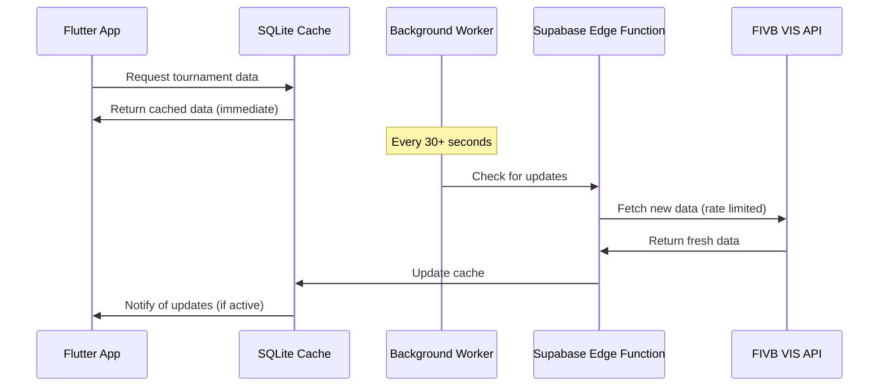

# Caching Architecture Strategy

**Critical Design Principle:** The application MUST function seamlessly during 30+ second API call gaps.

## Cache Hierarchy
1. **L1 Cache (Memory):** BLoC state management for active session data
2. **L2 Cache (Local SQLite):** Persistent tournament/match data via sqflite  
3. **L3 Cache (Key-Value):** User preferences and session data via Hive
4. **L4 Source (Remote):** Supabase + VIS integration with rate limiting

## Background Sync Strategy

## Data Freshness Management
- **Tournament Lists:** 30-60 second refresh cycle
- **Match Results:** Priority refresh for bookmarked tournaments  
- **Referee Assignments:** High-priority, immediate cache update
- **User Preferences:** Local-first, sync on background

## Offline-First Approach
- **Full Functionality:** App works completely offline with cached data
- **Graceful Degradation:** Clear indicators when data may be stale
- **Smart Prefetching:** Background worker prioritizes user's bookmarked tournaments
- **Conflict Resolution:** Last-write-wins for user preferences, server authority for tournament data

**Critical Updates Exception:** Negotiate faster refresh intervals for urgent tournament changes with push notification support.
