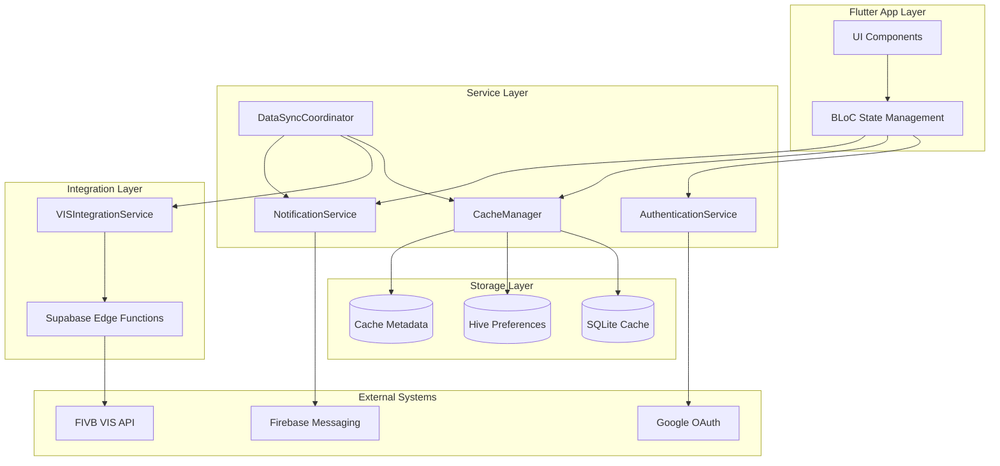

# Components

## VISIntegrationService
**Responsibility:** Manages all FIVB VIS API communication with rate limiting and error handling

**Key Interfaces:**
- fetchTournaments(filters): Future<List<Tournament>>
- fetchMatchResults(tournamentId): Future<List<Match>>
- fetchRefereeAssignments(tournamentId): Future<List<RefereeAssignment>>

**Dependencies:** Supabase Edge Functions, rate limiting controller, error retry logic

**Technology Stack:** Supabase Edge Functions (TypeScript), rate limiting middleware, VIS API client

## CacheManager
**Responsibility:** Handles all local data storage, sync coordination, and cache invalidation

**Key Interfaces:**
- getCachedTournaments(filters): List<Tournament>
- updateCache(data): Future<void>
- scheduleSync(priority): Future<void>

**Dependencies:** SQLite database, background sync worker, cache metadata tracker

**Technology Stack:** sqflite for local storage, workmanager for background tasks, Hive for preferences

## AuthenticationService
**Responsibility:** Google OAuth integration via Supabase Auth with session management

**Key Interfaces:**
- signInWithGoogle(): Future<UserProfile>
- getCurrentUser(): UserProfile?
- signOut(): Future<void>

**Dependencies:** Supabase Auth, Google OAuth provider, local session storage

**Technology Stack:** supabase_flutter auth, google_sign_in package, secure storage

## NotificationService
**Responsibility:** Push notifications for critical tournament updates and user reminders

**Key Interfaces:**
- sendTournamentUpdate(tournamentId, message): Future<void>
- scheduleReminder(bookmark): Future<void>
- registerForPushNotifications(): Future<void>

**Dependencies:** Firebase Cloud Messaging, Supabase real-time subscriptions, user preferences

**Technology Stack:** firebase_messaging, flutter_local_notifications, background sync triggers

## DataSyncCoordinator
**Responsibility:** Orchestrates background data synchronization respecting API rate limits

**Key Interfaces:**
- coordinateSync(): Future<void>
- prioritizeUserBookmarks(): Future<void>
- handleSyncFailure(error): Future<void>

**Dependencies:** VIS Integration Service, Cache Manager, user bookmark priorities

**Technology Stack:** workmanager for scheduling, priority queue management, exponential backoff

## Component Diagrams

## UI Component Architecture

Based on the integrated view schema, the UI layer includes these core components:

### View Components
- **LoginScreen:** Authentication interface with Google OAuth
- **Dashboard:** Personalized referee assignment overview
- **TournamentListView:** Filterable tournament master list
- **TournamentDetailView:** Comprehensive tournament information
- **MatchDetailView:** Detailed match results and statistics
- **RefereeDetailView:** Individual referee profiles and history
- **BookmarksView:** User's saved tournaments
- **UserProfileView:** Account and preference management
- **SettingsView:** Application configuration

### Shared UI Components
- **TournamentCard:** Reusable tournament summary display
- **MatchCard:** Match information summary
- **DataTable:** Generic sortable/filterable table
- **FilterPanel:** Advanced filtering controls
- **StatusBadge:** Visual status indicators
- **BookmarkButton:** Toggle bookmark state
- **ExportButton:** Data export with format options
- **LoadingSpinner:** Async operation feedback
- **OfflineIndicator:** Network status display

### BLoC State Management
- **AuthBloc:** Authentication state and user session
- **TournamentBloc:** Tournament data and filtering
- **MatchBloc:** Match details and results
- **BookmarkBloc:** User bookmark management
- **SettingsBloc:** User preferences and configuration
- **SyncBloc:** Background synchronization status

### Component Integration Flow
The UI components integrate with services through BLoC pattern:
1. UI components trigger actions through BLoC events
2. BLoCs coordinate with service layer components
3. Services return data through BLoC states
4. UI components rebuild based on state changes

**Reference:** Complete view hierarchy and component specifications available in `/docs/view-schema.md`
