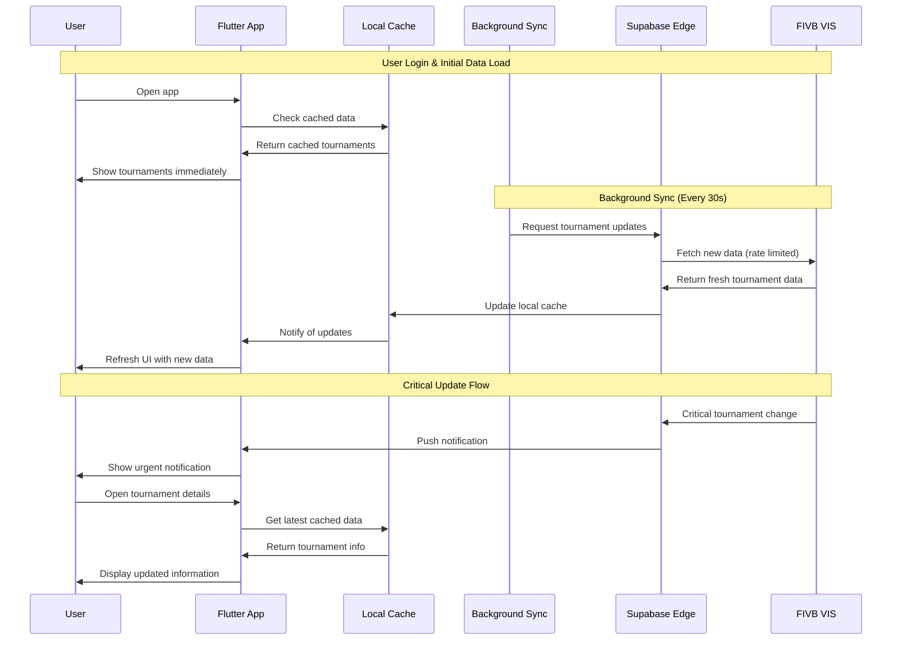

# Core Workflows

```mermaid
sequenceDiagram
    participant User
    participant Flutter as Flutter App
    participant Cache as Local Cache
    participant Sync as Background Sync
    participant Edge as Supabase Edge
    participant VIS as FIVB VIS

    Note over User,VIS: User Login & Initial Data Load
    User->>Flutter: Open app
    Flutter->>Cache: Check cached data
    Cache->>Flutter: Return cached tournaments
    Flutter->>User: Show tournaments immediately
    
    Note over Sync,VIS: Background Sync (Every 30s)
    Sync->>Edge: Request tournament updates
    Edge->>VIS: Fetch new data (rate limited)
    VIS->>Edge: Return fresh tournament data
    Edge->>Cache: Update local cache
    Cache->>Flutter: Notify of updates
    Flutter->>User: Refresh UI with new data
    
    Note over User,VIS: Critical Update Flow
    VIS->>Edge: Critical tournament change
    Edge->>Flutter: Push notification
    Flutter->>User: Show urgent notification
    User->>Flutter: Open tournament details
    Flutter->>Cache: Get latest cached data
    Cache->>Flutter: Return tournament info
    Flutter->>User: Display updated information
```
