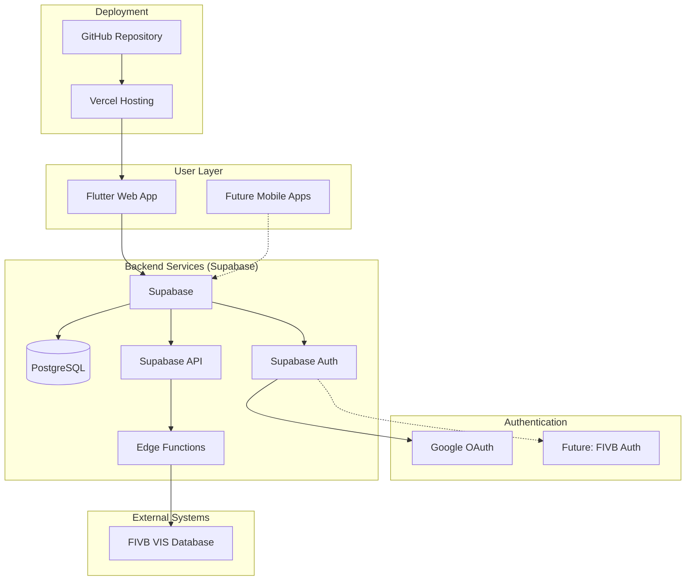

# High Level Architecture

## Technical Summary

BeachRef employs a **modern Flutter-first architecture** with Supabase as the backend-as-a-service provider. The system follows a **client-centric pattern** where Flutter handles all UI logic and state management, while Supabase provides database, authentication, and real-time capabilities. Authentication starts with **Google Auth via Supabase** for rapid MVP deployment, with a designed upgrade path to FIVB credential integration. The architecture is designed for **cross-platform scalability** - starting with Flutter Web deployed on Vercel, with a clear path to iOS/Android mobile apps using the same codebase and backend infrastructure.

## High Level Overview

1. **Architectural Style:** Client-Server with BaaS (Backend-as-a-Service)
2. **Repository Structure:** Monorepo - Single Flutter project with web/mobile targets
3. **Service Architecture:** Flutter client + Supabase backend services
4. **Primary User Flow:** User authenticates via Google → Flutter app queries Supabase → Real-time data sync with VIS integration via Edge Functions
5. **Key Decisions:** 
   - Flutter Web for immediate deployment, mobile-ready architecture
   - Supabase for rapid backend development and scaling
   - Google Auth for MVP with FIVB integration roadmap
   - Vercel for optimized Flutter Web hosting

## High Level Project Diagram

## Architectural and Design Patterns

- **BLoC Pattern (Business Logic Component):** Flutter state management for complex UI state and business logic separation - _Rationale:_ Industry standard for Flutter, enables testability and clear separation of concerns
- **Repository Pattern:** Abstract data access through Supabase client - _Rationale:_ Enables testing, future backend flexibility, and clean API boundaries  
- **Provider Pattern:** Dependency injection for services and state management - _Rationale:_ Flutter's recommended approach for dependency management and state sharing
- **Event-Driven Updates:** Real-time data synchronization using Supabase subscriptions - _Rationale:_ Keeps referee data current during tournaments without manual refresh
- **OAuth2 + JWT Pattern:** Google authentication with Supabase JWT tokens - _Rationale:_ Secure, scalable authentication with smooth upgrade path to FIVB integration
- **Cache-First Architecture:** Local SQLite caching with 30+ second background sync intervals - _Rationale:_ VIS API rate limiting requires intelligent caching to ensure data availability during gaps
- **Background Sync Pattern:** Scheduled data fetching with priority queuing - _Rationale:_ Respects API limits while maintaining fresh data for critical referee workflows
