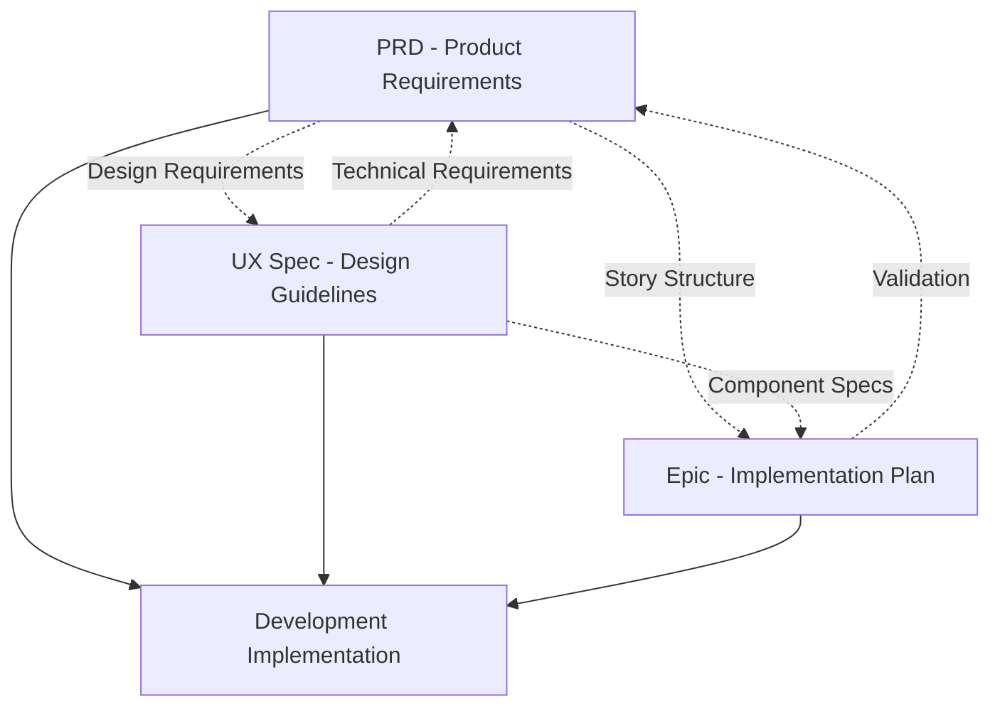

# BeachRef Documentation Integration Guide

## Document Overview

This guide explains how the three core documents work together to provide comprehensive guidance for the referee UX enhancement project.

### Document Relationship

## Document Roles

### 1. PRD (Product Requirements Document)
**Location**: `docs/prd/` (sharded) and `docs/prd.md` (complete)
**Purpose**: Business requirements and technical constraints
**Key Sections**:
- Project analysis and scope
- Functional/Non-functional requirements (FR1-FR10, NFR1-NFR6)
- Technical integration requirements
- Epic and story structure

**Who Uses**: Product managers, technical leads, stakeholders for approval and reference

### 2. UX Specification 
**Location**: `docs/front-end-spec.md`
**Purpose**: Detailed user experience design guidelines
**Key Sections**:
- User personas and usability goals
- Information architecture and user flows
- Component library specifications
- Visual design system (colors, typography, spacing)
- Accessibility and performance guidelines

**Who Uses**: Designers, developers for implementation details, QA for testing criteria

### 3. Epic Document
**Location**: `docs/epic-1-referee-ux-enhancement.md`
**Purpose**: Implementation roadmap and story breakdown
**Key Sections**:
- Epic overview and goals
- 6 sequential stories with priorities and dependencies
- Technical context and risk mitigation
- Component implementation mapping

**Who Uses**: Development team, scrum master, project tracking

## Integration Points

### Requirements to Design
| PRD Requirement | UX Specification Section | Implementation Detail |
|-----------------|--------------------------|---------------------|
| FR1 - Table redesign | Tournament Table Component | shadcn Table with sorting/search |
| FR2 - Card components | Tournament Card Component | Mobile-first touch optimization |
| FR3 - Status badges | Tournament Status Badge | Color-coded with outdoor visibility |
| FR8 - Dual view toggle | Modified/New Screens | Table (desktop) / Card (mobile) primary |
| NFR3 - Accessibility | Accessibility Requirements | WCAG 2.1 AA + outdoor enhancements |

### Design to Implementation
| UX Component | Epic Story | shadcn Component | Priority |
|--------------|------------|------------------|----------|
| Tournament Table | Story 1.3 | Table + Input | High |
| Tournament Cards | Story 1.4 | Card + Badge | Medium |
| Detail Sheet | Stories 1.4-1.6 | Sheet + Tabs | High |
| Loading States | Story 1.2 | Skeleton | High |
| Error Handling | Story 1.5 | Alert + Toast | High |

### Story Validation Matrix
| Epic Story | PRD Requirements Fulfilled | UX Guidelines Addressed |
|------------|---------------------------|------------------------|
| 1.1 Foundation | CR1-CR4 (compatibility) | Design system setup |
| 1.2 Loading | FR4 (loading states) | Professional loading UX |
| 1.3 Table | FR1, FR8, FR9 (table, views, search) | Desktop tournament display |
| 1.4 Cards | FR2, FR3, FR8 (cards, badges, toggle) | Mobile tournament interface |
| 1.5 Errors | FR5 (error handling) | Clear error communication |
| 1.6 Mobile | FR10, NFR4 (touch, responsive) | Mobile-first optimization |

## Usage Workflow

### For Development Team
1. **Start with Epic** for story prioritization and technical context
2. **Reference PRD** for acceptance criteria and requirements validation
3. **Follow UX Spec** for detailed implementation guidelines
4. **Cross-check** integration matrix for consistency

### For Design Review
1. **UX Spec** as primary design reference
2. **PRD requirements** for business validation
3. **Epic stories** for implementation feasibility

### For Testing & QA
1. **PRD requirements** for test case creation
2. **UX Spec accessibility section** for compliance testing
3. **Epic acceptance criteria** for story completion validation

## Consistency Checks

### Color Palette Alignment
- **PRD**: FIVB professional aesthetic
- **UX Spec**: FIVB blue (#0066CC), beach volleyball orange (#FF6B35)
- **Epic**: FIVB-aligned design system

### Performance Goals Alignment
- **PRD**: Mobile network optimization, fast loading
- **UX Spec**: First Contentful Paint < 2s, 100ms interaction response
- **Epic**: Performance maintained or improved

### Accessibility Standards Alignment
- **PRD**: WCAG 2.1 AA with outdoor visibility
- **UX Spec**: 4.5:1 contrast ratio, 44px touch targets
- **Epic**: Tournament environment usability

## Document Maintenance

### When to Update
- **PRD**: Requirement changes, scope modifications
- **UX Spec**: Design system changes, user research findings
- **Epic**: Story priorities, implementation discoveries

### Cross-Reference Updates
When updating any document, check for impacts on:
- Requirements mapping
- Component specifications
- Story acceptance criteria
- Technical constraints

---

*This integration ensures all team members have consistent, comprehensive guidance for the referee UX enhancement project.*

---

🤖 Generated with [Claude Code](https://claude.ai/code)

Co-Authored-By: Claude <noreply@anthropic.com>