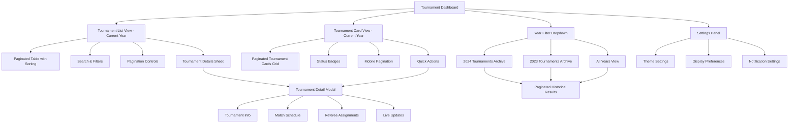
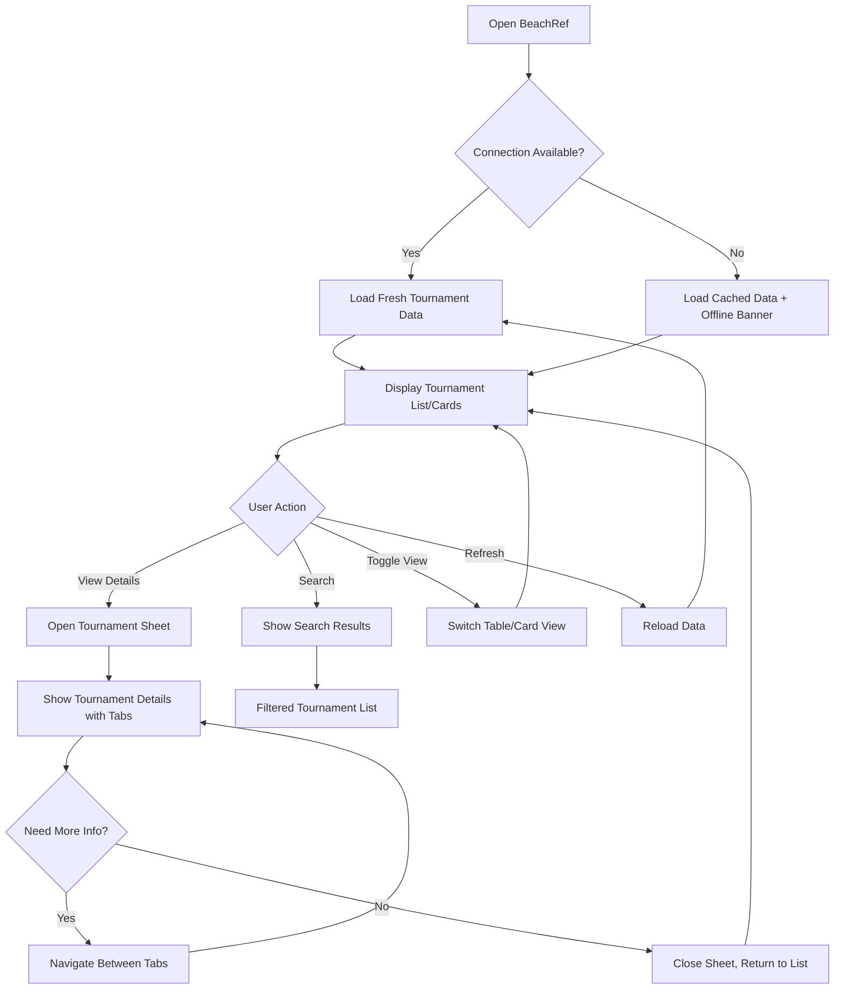
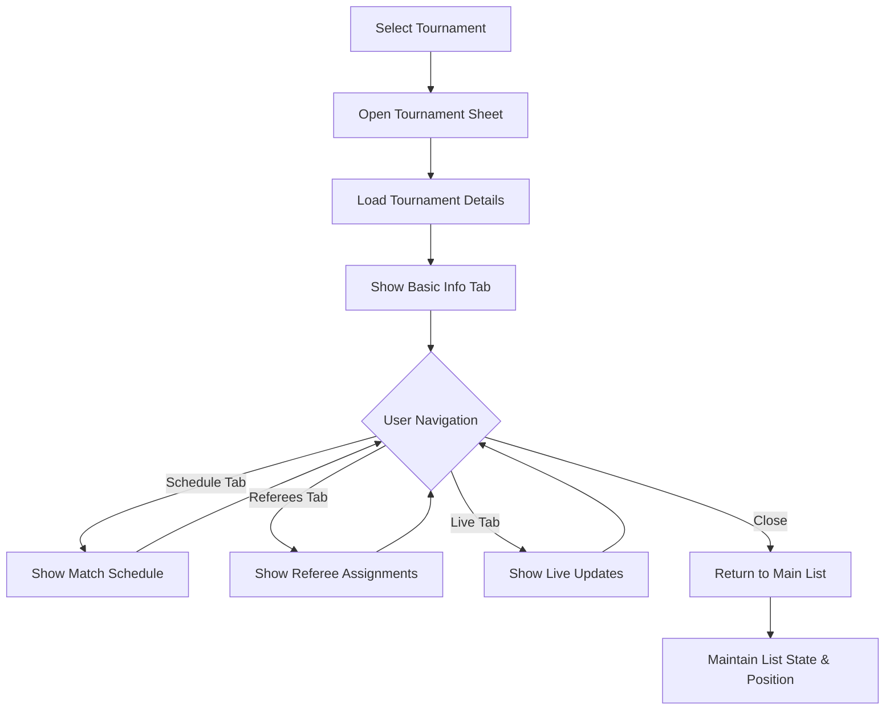
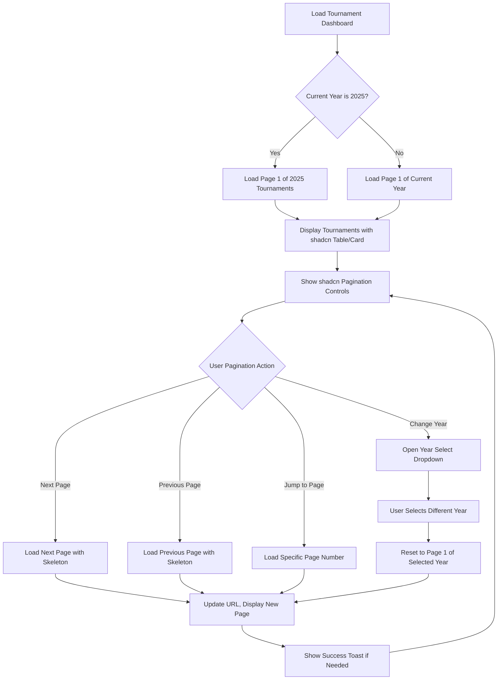

# BeachRef UI/UX Specification

## Introduction

This document defines the user experience goals, information architecture, user flows, and visual design specifications for BeachRef's user interface enhancement. It serves as the foundation for implementing shadcn/ui components and creating a professional FIVB-style referee dashboard, ensuring a cohesive and user-centered experience that works seamlessly in tournament environments.

### Overall UX Goals & Principles

#### Target User Personas

**Tournament Referees:** Professional beach volleyball referees who need quick access to tournament information during active events, often using mobile devices in challenging outdoor conditions with variable connectivity

**Referee Coordinators:** Tournament officials who manage referee assignments and need overview capabilities across multiple tournaments

**Technical Officials:** FIVB representatives and event organizers who require detailed tournament data for administrative purposes

#### Usability Goals

- **Mobile-first efficiency:** Referees can access critical tournament information within 3 seconds on mobile devices
- **Offline resilience:** Core functionality works with cached data during connectivity issues common in tournament venues
- **Glance-ability:** Tournament status and key information visible at a glance without scrolling on mobile screens
- **Touch-friendly:** All interactive elements meet 44px minimum touch targets for use with referee gloves

#### Design Principles

1. **Tournament-ready reliability** - Every interface element must work flawlessly in high-pressure tournament environments
2. **Mobile-first clarity** - Prioritize mobile experience with clear visual hierarchy for outdoor visibility
3. **FIVB professional aesthetic** - Maintain sports federation professionalism while ensuring accessibility
4. **Progressive disclosure** - Show essential information first, detailed data on demand
5. **Immediate feedback** - Every action provides clear confirmation, critical for tournament-day stress

#### Change Log

| Date | Version | Description | Author |
|------|---------|-------------|---------|
| 2025-07-30 | 1.0 | Initial UX specification for shadcn component migration | Sally (UX Expert) |

## Information Architecture (IA)

### Site Map / Screen Inventory



### Navigation Structure

**Primary Navigation:** Single-page dashboard with view toggle (Table/Card), year filter dropdown, and pagination controls using shadcn Button and Select components

**Secondary Navigation:** Within tournament details - tabbed interface using shadcn Tabs component for different information categories (Info, Schedule, Referees, Live)

**Pagination Navigation:** Bottom-aligned pagination controls with shadcn Button components for mobile, enhanced shadcn Pagination component for desktop

**Breadcrumb Strategy:** Year context indicator in header showing "2025 Tournaments" with shadcn Badge component, minimal breadcrumbs within detail views

## User Flows

### Critical Tournament Information Access Flow

**User Goal:** Quickly access tournament information during tournament day operations

**Entry Points:** 
- Direct URL access on mobile device
- Bookmark/shortcut from referee device
- Link from tournament management system

**Success Criteria:** Tournament list loads within 3 seconds, critical information visible without scrolling

#### Flow Diagram



#### Edge Cases & Error Handling:

- **VIS API timeout:** Show cached data with timestamp and retry option using Toast notifications
- **No tournaments found:** Display empty state with helpful guidance and manual refresh option
- **Network connectivity loss:** Graceful degradation to offline mode with clear status indicators
- **Device orientation change:** Seamless layout adaptation without losing current context
- **Touch target too small:** Minimum 44px targets with adequate spacing for gloved hands

**Notes:** Flow prioritizes speed and reliability over features, with clear visual feedback at each step using shadcn components (Toast, Alert, Skeleton, Badge)

### Tournament Detail Exploration Flow

**User Goal:** Access detailed tournament information for referee assignment and preparation

**Entry Points:**
- Click tournament row in table view
- Tap tournament card in card view
- Direct link to specific tournament

**Success Criteria:** Detailed information loads quickly with clear categorization and easy navigation back to main view

#### Flow Diagram



#### Edge Cases & Error Handling:

- **Tournament data incomplete:** Show available information with clear indicators of missing data
- **Real-time updates fail:** Fallback to manual refresh with timestamp display
- **Sheet won't close:** Alternative close methods (swipe, escape key, backdrop click)
- **Tab content fails to load:** Show error state with retry option per tab

**Notes:** Sheet component provides modal experience without losing main list context, critical for tournament-day multitasking

### Tournament Pagination Flow (Current Year Focus)

**User Goal:** Navigate through current year tournaments efficiently with minimal data loading

**Entry Points:**
- Homepage load (defaults to current year 2025, page 1)
- Direct URL with page parameter
- Year filter selection maintaining pagination context

**Success Criteria:** Page loads in under 2 seconds, clear indication of current position, quick navigation between adjacent pages

#### Flow Diagram



#### Edge Cases & Error Handling:
- **Page number exceeds total pages:** Redirect to last valid page with Toast notification using shadcn components
- **Network timeout during pagination:** Show cached data with Alert component indicating stale data
- **Year with no tournaments:** Display empty state using shadcn Card with clear messaging
- **Invalid year selection:** Fallback to current year with error Toast
- **URL manipulation:** Validate page parameters and redirect to valid state

**Notes:** Pagination maintains year context in URL structure (`/tournaments/2025/page/2`) using Next.js routing, all loading states use shadcn Skeleton components

## Wireframes & Mockups

**Primary Design Files:** To be created in Figma following this specification - [Link to be added]

### Key Screen Layouts

#### Tournament Dashboard (Main View)

**Purpose:** Primary interface for accessing all tournament information with dual view options

**Key Elements:**
- Header with BeachRef branding and view toggle (Table/Card buttons)
- Search bar with real-time filtering
- Loading states using Skeleton components
- Tournament list/grid with shadcn Table or Card components
- Status indicators using Badge components
- Settings access via Sheet trigger button

**Interaction Notes:** Touch-friendly controls with clear active states, swipe gestures for mobile navigation

**Design File Reference:** [Figma frame to be linked]

#### Tournament Detail Sheet

**Purpose:** Detailed tournament information overlay without losing main view context

**Key Elements:**
- Sheet header with tournament name and close button
- Tabbed navigation (Info, Schedule, Referees, Live)
- Scrollable content area with organized information
- Action buttons for common referee tasks
- Connection status indicator

**Interaction Notes:** Swipe to close, keyboard navigation support, scrollable content with momentum

**Design File Reference:** [Figma frame to be linked]

#### Mobile Tournament Cards

**Purpose:** Touch-optimized tournament browsing for mobile devices

**Key Elements:**
- Card grid with 2-column layout on larger mobile screens
- Tournament status badges prominently displayed
- Essential info visible at card level
- Touch targets optimized for gloved hands
- Progressive loading with skeleton states

**Interaction Notes:** Card tap opens detail sheet, long press for quick actions menu

**Design File Reference:** [Figma frame to be linked]

## Component Library / Design System

**Design System Approach:** Hybrid approach using shadcn/ui as the foundation component library, with custom tournament-specific components built on top of shadcn primitives

### Core Components

#### Tournament Table Component

**Purpose:** Display tournament data in sortable, searchable table format optimized for desktop and tablet viewing

**Variants:** 
- Standard table with full data columns
- Compact table with essential columns only
- Mobile-responsive table with horizontal scroll

**States:** Loading (skeleton), loaded, error, empty, filtered

**Usage Guidelines:** Use for desktop/tablet primary view, ensure horizontal scroll indicators on mobile, maintain column sorting persistence

#### Tournament Card Component

**Purpose:** Mobile-first tournament information display with touch-optimized interaction

**Variants:**
- Standard card (full information)
- Compact card (essential info only)
- Featured card (highlighted tournaments)

**States:** Default, hover, pressed, loading, error

**Usage Guidelines:** Primary mobile interface, ensure 44px minimum touch targets, use for glanceable information

#### Tournament Status Badge

**Purpose:** Clear visual indication of tournament status and type

**Variants:**
- Tournament status (Upcoming, Live, Completed)
- Gender categories (Men, Women, Mixed)
- Tournament level (World Tour, Continental, National)
- Year indicators (Current, Historical)

**States:** Default, muted (for completed tournaments), highlighted (current year)

**Usage Guidelines:** Consistent color coding, high contrast for outdoor visibility, support for color-blind users

#### Pagination Component Suite

**Purpose:** Navigate through tournament data efficiently with year context

**Variants:**
- Desktop: Full shadcn Pagination with numbered pages, prev/next, jump controls
- Mobile: Simplified prev/next buttons with page indicator
- Compact: Minimal version for small spaces

**States:** Loading (skeleton overlay), active page (highlighted), disabled (first/last page), error (retry option)

**Usage Guidelines:** Minimum 48px touch targets on mobile, clear current position indication, maintain year context

#### Tournament Detail Sheet

**Purpose:** Overlay detailed tournament information without losing main view context

**Variants:**
- Full height sheet (mobile)
- Partial height sheet (tablet/desktop)
- Modal dialog (desktop fallback)

**States:** Opening, open, closing, error loading content

**Usage Guidelines:** Swipe gestures on mobile, maintain focus management, provide multiple close methods

#### Loading Skeleton Components

**Purpose:** Professional loading states that match actual content layout

**Variants:**
- Table row skeletons
- Card skeletons
- Detail sheet skeletons
- Search result skeletons

**States:** Pulsing animation, static placeholder

**Usage Guidelines:** Match actual content dimensions, show realistic loading times, fade transition to real content

## Branding & Style Guide

### Visual Identity

**Brand Guidelines:** FIVB-inspired professional sports aesthetic with modern web application patterns - maintaining beach volleyball sport identity while ensuring digital usability

### Color Palette

| Color Type | Hex Code | Usage |
|------------|----------|-------|
| Primary | #0066CC | FIVB blue for headers, primary buttons, active states |
| Secondary | #FF6B35 | Beach volleyball orange for accents, status indicators |
| Accent | #00A86B | Success states, live tournament indicators |
| Success | #16A34A | Positive feedback, confirmations, completed states |
| Warning | #F59E0B | Cautions, important notices, upcoming deadlines |
| Error | #DC2626 | Errors, connection issues, destructive actions |
| Neutral | #64748B, #E2E8F0, #F8FAFC | Text, borders, backgrounds with high contrast |

### Typography

#### Font Families

- **Primary:** Inter (optimized for UI, excellent readability on mobile)
- **Secondary:** System fonts fallback (SF Pro on iOS, Roboto on Android)
- **Monospace:** JetBrains Mono (for tournament codes, technical data)

#### Type Scale

| Element | Size | Weight | Line Height |
|---------|------|--------|-------------|
| H1 | 2rem (32px) | 700 (Bold) | 1.2 |
| H2 | 1.5rem (24px) | 600 (Semibold) | 1.3 |
| H3 | 1.25rem (20px) | 600 (Semibold) | 1.4 |
| Body | 1rem (16px) | 400 (Regular) | 1.6 |
| Small | 0.875rem (14px) | 400 (Regular) | 1.5 |

### Iconography

**Icon Library:** Lucide React icons (consistent with shadcn/ui ecosystem)

**Usage Guidelines:** 
- Minimum 24px for touch targets
- High contrast for outdoor visibility
- Consistent visual weight across icon set
- Include text labels for critical actions

### Spacing & Layout

**Grid System:** CSS Grid with shadcn's responsive utilities

**Spacing Scale:** 
- Base unit: 4px
- Scale: 4px, 8px, 12px, 16px, 24px, 32px, 48px, 64px
- Consistent application using shadcn's spacing tokens

## Accessibility Requirements

### Compliance Target

**Standard:** WCAG 2.1 AA compliance with additional considerations for outdoor mobile usage

### Key Requirements

**Visual:**
- Color contrast ratios: 4.5:1 minimum for normal text, 3:1 for large text, enhanced contrast for outdoor visibility
- Focus indicators: 2px solid outline with high contrast color, visible on all interactive elements
- Text sizing: Minimum 16px base size, scalable up to 200% without horizontal scrolling

**Interaction:**
- Keyboard navigation: Full functionality accessible via keyboard, logical tab order, skip links for main content
- Screen reader support: Semantic HTML, proper headings hierarchy, descriptive labels for all interactive elements
- Touch targets: Minimum 44px touch targets with adequate spacing, optimized for gloved hands in tournament settings

**Content:**
- Alternative text: Descriptive alt text for country flags, tournament status icons, and any informational graphics
- Heading structure: Proper h1-h6 hierarchy for screen readers, logical content organization
- Form labels: Explicit labels for search inputs, filter controls, and any form elements

### Testing Strategy

- Automated testing with axe-core during development
- Manual keyboard navigation testing
- Screen reader testing with NVDA/JAWS
- Mobile accessibility testing with device screen readers
- Outdoor visibility testing in various lighting conditions

## Responsiveness Strategy

### Breakpoints

| Breakpoint | Min Width | Max Width | Target Devices |
|------------|-----------|-----------|----------------|
| Mobile | 320px | 767px | Phones, small tablets in portrait |
| Tablet | 768px | 1023px | Tablets, small laptops |
| Desktop | 1024px | 1439px | Laptops, desktop monitors |
| Wide | 1440px | - | Large monitors, external displays |

### Adaptation Patterns

**Layout Changes:** 
- Mobile: Single column card layout, collapsible table with horizontal scroll
- Tablet: Two-column card layout, full table with adjusted column widths
- Desktop: Multi-column layouts, side-by-side sheet presentations

**Navigation Changes:**
- Mobile: Bottom sheet for tournament details, hamburger menu for settings
- Tablet: Side sheet for details, persistent settings panel
- Desktop: Modal dialogs, always-visible navigation elements

**Content Priority:**
- Mobile: Essential tournament info only, progressive disclosure for details
- Tablet: More tournament data visible, secondary information available
- Desktop: Full information display, multi-panel layouts

**Interaction Changes:**
- Mobile: Touch-optimized gestures, swipe actions, large touch targets
- Tablet: Hover states introduced, touch and cursor interaction
- Desktop: Full hover states, keyboard shortcuts, right-click context menus

## Animation & Micro-interactions

### Motion Principles

Subtle, purposeful animations that enhance usability without distraction. Focus on state transitions, loading feedback, and spatial relationships. All animations respect `prefers-reduced-motion` accessibility setting.

### Key Animations

- **Sheet Open/Close:** Slide up from bottom with spring easing (Duration: 300ms, Easing: ease-out)
- **Card Hover:** Subtle lift shadow effect (Duration: 150ms, Easing: ease-in-out)
- **Loading Skeleton:** Gentle pulse animation (Duration: 1.5s, Easing: ease-in-out, infinite)
- **Toast Notifications:** Slide in from top with bounce (Duration: 400ms, Easing: cubic-bezier(0.68, -0.55, 0.265, 1.55))
- **Search Filtering:** Smooth height transitions for filtered results (Duration: 250ms, Easing: ease-out)
- **Status Badge Updates:** Color transition for status changes (Duration: 200ms, Easing: ease-in-out)

## Performance Considerations

### Performance Goals

- **Page Load:** First Contentful Paint under 2 seconds on 3G networks
- **Interaction Response:** UI feedback within 100ms for all user interactions
- **Animation FPS:** Consistent 60fps for all animations and transitions

### Design Strategies

Progressive loading with skeleton states, optimized image formats for country flags, lazy loading for non-critical components, efficient bundle splitting with shadcn tree-shaking, aggressive caching for tournament data with smart refresh strategies

## shadcn Component Implementation Mapping

### Primary Components to Install

```bash
npx shadcn-ui@latest add table card badge sheet toast tabs skeleton alert button input select pagination
```

### Component Mapping Strategy

**Tournament List View:**
- `Table` component for desktop tournament display with pagination
- `Card` component for mobile tournament cards in paginated grid
- `Skeleton` components for loading states during page transitions
- `Badge` components for status indicators and year context

**Pagination Implementation:**
- `Pagination` component for desktop full pagination controls
- `Button` components for mobile prev/next navigation
- `Select` component for year filter dropdown
- `Badge` component for current year indicator

**Tournament Details:**
- `Sheet` component for mobile detail overlay
- `Tabs` component for organizing detail sections
- `Alert` component for error states and important notices
- `Toast` component for real-time notifications

**Search & Interaction:**
- `Input` component for search functionality
- `Button` component for actions, toggles, and pagination controls
- `Select` component for year filtering and results per page
- Enhanced touch targets with custom styling for gloved usage

**Status & Feedback:**
- `Badge` variants for tournament states and year indicators
- `Alert` variants for connection status and pagination errors
- `Toast` for page load confirmations and network updates
- `Skeleton` variants for different pagination loading states

## Next Steps

### Immediate Actions

1. Install shadcn/ui CLI and configure theme with FIVB color palette
2. Create Figma wireframes based on these specifications
3. Set up component storybook for isolated development and testing
4. Begin implementation with foundational components (Table, Card, Sheet)
5. Establish responsive breakpoint testing strategy
6. Configure accessibility testing tools and baseline audits

### Design Handoff Checklist

- [x] All user flows documented
- [x] Component inventory complete
- [x] Accessibility requirements defined
- [x] Responsive strategy clear
- [x] Brand guidelines incorporated
- [x] Performance goals established
- [ ] Figma wireframes created
- [ ] Component storybook set up
- [ ] Development environment configured
- [ ] Initial component implementations tested

### Technical Implementation Priority

**Phase 1 (Foundation):** shadcn setup, theme configuration, basic Table and Card components

**Phase 2 (Core UX):** Sheet component for details, Toast notifications, loading states

**Phase 3 (Enhancement):** Advanced filtering, accessibility improvements, performance optimization

**Phase 4 (Polish):** Animations, advanced responsive features, PWA considerations

---

🤖 Generated with [Claude Code](https://claude.ai/code)

Co-Authored-By: Claude <noreply@anthropic.com>