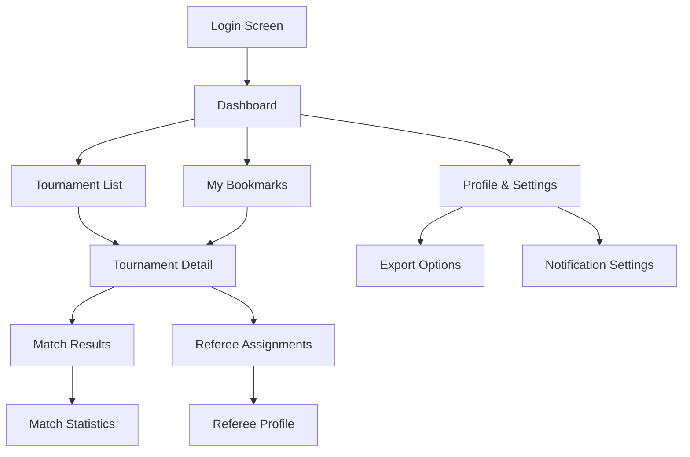
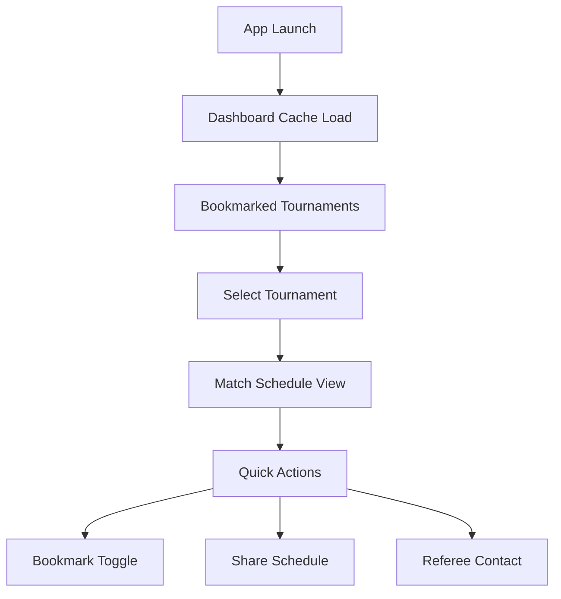

# BeachRef UI/UX Specification

This document defines the user experience goals, information architecture, user flows, and visual design specifications for **BeachRef's** user interface. It serves as the foundation for visual design and frontend development, ensuring a cohesive and user-centered experience optimized for beach volleyball referees working in challenging outdoor conditions.

## Overall UX Goals & Principles

### Target User Personas

**Primary Persona - Beach Volleyball Referee (Outdoor Professional):**
- Professional officials working FIVB tournaments in bright sunlight conditions
- Need instant, glare-resistant access to tournament data during matches
- Prefer minimal, distraction-free interfaces that work under time pressure
- Use mobile devices with potentially wet/sandy hands at beach venues
- Value reliability and speed over visual complexity

**Secondary Persona - Tournament Director:**
- Coordinates multiple referees and tournament logistics
- Desktop/tablet usage in covered areas or indoor facilities
- Requires comprehensive data views and export capabilities
- Professional presentation standards for FIVB compliance

### Usability Goals

- **Sunlight Readability:** High contrast design readable in direct beach sunlight
- **One-Hand Operation:** All critical functions accessible with thumb navigation
- **Sub-Second Response:** All interactions complete in under 500ms
- **Simplified Interface:** Maximum 3-tap depth for any function
- **Offline Reliability:** Core functions work without connectivity during matches

### Design Principles

1. **Sunlight-First Design** - High contrast, minimal shadows, optimized for outdoor visibility
2. **Thumb-Zone Optimized** - Critical actions within natural thumb reach areas
3. **Minimal Cognitive Load** - Clean, distraction-free interfaces with clear hierarchy
4. **Professional Minimalism** - FIVB-appropriate design that inspires referee confidence
5. **Speed Over Decoration** - Fast, lightweight interactions with purposeful animations

### Change Log
| Date | Version | Description | Author |
|------|---------|-------------|---------|
| 2025-07-26 | 1.0 | Initial UI/UX specification optimized for outdoor use | BMad Master |

## Information Architecture (IA)

### Site Map / Screen Inventory

### Navigation Structure

**Primary Navigation:** Bottom tab bar with high-contrast icons and text labels
**Secondary Navigation:** Header actions with large touch targets (44px minimum)
**Breadcrumb Strategy:** Simple back navigation with clear context indicators

## User Flows

### Quick Tournament Access Flow (Primary Use Case)

**User Goal:** Instantly access bookmarked tournament information during match breaks

**Entry Points:** App launch from mobile home screen

**Success Criteria:** Tournament data visible within 2 seconds of app launch

#### Flow Diagram

#### Edge Cases & Error Handling:
- No cached data: Show offline message with last sync time
- Stale data warning: Prominent indicator with manual refresh option
- Connection timeout: Graceful degradation with cached content

## Key Screen Layouts

### Dashboard Screen (Sunlight-Optimized)
**Purpose:** Instant access to priority tournament information

**Key Elements:**
- **High-Contrast Header:** White text on dark navy background (#003366)
- **Large Touch Cards:** Minimum 60px height with 16px spacing
- **Sync Status Indicator:** Prominent connection/freshness status
- **Quick Action Buttons:** Export, bookmark, refresh with icon + text

**Sunlight Optimizations:**
- White backgrounds with dark text (no gradients or light gray text)
- Bold font weights (600+) for improved readability
- High contrast borders (2px solid) for card separation
- No drop shadows or subtle effects that wash out in sunlight

### Tournament List Screen (Minimal & Fast)
**Purpose:** Fast filtering and browsing of available tournaments

**Key Elements:**
- **Simplified Filter Bar:** Maximum 4 filter options visible
- **Card-Based Layout:** White cards with dark borders and headers
- **Large Typography:** 16px minimum body text, 18px+ for headers
- **Touch-Friendly Controls:** 44px minimum touch targets

**Performance Features:**
- Virtual scrolling for large lists
- Skeleton loading states
- Instant filter application without server calls

## Component Library / Design System

### Design System Approach
**Flutter Material 3 + Custom Referee Theme** - Leveraging Material Design foundations with beach volleyball-specific customizations

### Core Components

#### **RefereeCard (Primary Component)**
**Purpose:** Display tournament/match information in sunlight-readable format
**Variants:** Tournament Card, Match Card, Referee Assignment Card
**States:** Default, Selected, Bookmarked, Offline, Loading
**Sunlight Features:**
- White background with 2px solid border (#003366)
- Bold headers (700 weight) with high contrast text
- Large touch areas (minimum 60px height)
- Clear status indicators (colored dots, not subtle text)

#### **HighContrastButton**
**Purpose:** Action buttons optimized for outdoor visibility
**Variants:** Primary (Navy), Secondary (White/Navy border), Warning (Red)
**States:** Default, Pressed, Disabled, Loading
**Features:**
- Minimum 48px height for touch accessibility
- Bold text labels with icon reinforcement
- High contrast color combinations
- Haptic feedback on interaction

#### **SunlightDataTable**
**Purpose:** Tournament and match data in readable table format
**Features:**
- Alternating row colors for easy scanning
- Bold headers with sort indicators
- Large font sizes (16px+)
- Horizontal scrolling on mobile
- No subtle hover effects (incompatible with touch)

## Branding & Style Guide

### Visual Identity
**FIVB Professional + Beach Referee Practicality** - Maintaining FIVB authority while optimizing for outdoor beach conditions

### Color Palette (Sunlight-Optimized)
| Color Type | Hex Code | Usage | Contrast Ratio |
|------------|----------|--------|----------------|
| Primary | #003366 | FIVB Navy - headers, primary actions | 12.63:1 on white |
| Secondary | #FFD700 | FIVB Gold - accents, status indicators | 5.14:1 on white |
| Accent | #0066CC | Interactive elements, links | 7.37:1 on white |
| Success | #00AA00 | Confirmations, successful sync | 5.32:1 on white |
| Warning | #FF8800 | Stale data, attention needed | 4.52:1 on white |
| Error | #CC0000 | Errors, failed operations | 9.13:1 on white |
| Background | #FFFFFF | Primary background for sunlight readability | - |
| Surface | #F8F9FA | Card backgrounds | - |
| Text Primary | #1A1A1A | Main text color | 16.09:1 on white |

### Typography (Readability-First)

#### Font Families
- **Primary:** **Inter** (optimized for data readability, excellent in sunlight)
- **Headers:** **Roboto** (700 weight for maximum visibility)
- **Monospace:** **JetBrains Mono** (clear number differentiation)

#### Type Scale (Sunlight-Readable)
| Element | Size | Weight | Line Height | Usage |
|---------|------|--------|-------------|--------|
| H1 | 32px | 700 | 1.2 | Screen titles |
| H2 | 24px | 700 | 1.3 | Section headers |
| H3 | 20px | 600 | 1.4 | Card titles |
| Body Large | 18px | 500 | 1.5 | Primary content |
| Body | 16px | 400 | 1.5 | Secondary content |
| Caption | 14px | 600 | 1.4 | Status indicators |

### Iconography (Consistency & Recognition)

#### Selected Icon Library: **Phosphor Icons**
**Rationale:** 
- **Excellent outdoor visibility** - Bold, clear strokes designed for mobile
- **Comprehensive sports coverage** - Includes sports-specific icons
- **Flutter native support** - `phosphor_flutter` package with excellent performance
- **Consistent design language** - Uniform stroke width and visual weight
- **Professional appearance** - Clean, modern aesthetic suitable for FIVB branding

#### Icon Implementation Standards
- **Size:** 24px minimum (32px for primary actions)
- **Stroke Width:** Bold variant (1.5px) for improved sunlight visibility
- **Color:** High contrast (#003366 on light backgrounds)
- **Usage:** Always paired with text labels for accessibility
- **Semantic Consistency:** Same icon always represents same action across app

#### Core Icon Set
- **Home:** `phosphor_flutter: house_bold`
- **Tournaments:** `phosphor_flutter: trophy_bold`
- **Bookmarks:** `phosphor_flutter: bookmark_simple_bold`
- **Profile:** `phosphor_flutter: user_circle_bold`
- **Search:** `phosphor_flutter: magnifying_glass_bold`
- **Filter:** `phosphor_flutter: funnel_bold`
- **Export:** `phosphor_flutter: export_bold`
- **Sync:** `phosphor_flutter: arrows_clockwise_bold`
- **Offline:** `phosphor_flutter: wifi_x_bold`
- **Success:** `phosphor_flutter: check_circle_bold`

### Spacing & Layout (Touch-Optimized)
**Grid System:** 8dp Material Design base with 16dp/24dp component margins
**Touch Targets:** 44px minimum (accessibility), 48px preferred (outdoor conditions)
**Card Spacing:** 16px between cards, 24px section separation
**Content Padding:** 16dp internal padding, 8dp for dense layouts

## Accessibility Requirements

### Compliance Target
**Standard:** WCAG 2.1 AA + Enhanced for Outdoor Use

### Key Requirements
**Visual (Sunlight-Enhanced):**
- Color contrast ratios: **7:1 minimum** (exceeds AA standard for outdoor visibility)
- Focus indicators: 3px solid outline with maximum contrast
- Text sizing: Supports 200% zoom, larger base sizes for outdoor readability

**Interaction (Beach-Friendly):**
- Touch targets: **48px minimum** (larger than standard for outdoor glove use)
- Screen reader support: Full semantic structure with live regions
- Keyboard navigation: Complete keyboard accessibility for desktop users

**Content:**
- Alternative text: Descriptive labels for all status indicators and icons
- Heading structure: Clear H1>H2>H3 hierarchy
- Form labels: Explicit labels with high contrast

### Testing Strategy
Automated testing with axe-core, manual testing in bright outdoor conditions, touch navigation with gloves

## Responsiveness Strategy

### Breakpoints (Beach-Optimized)
| Breakpoint | Min Width | Max Width | Target Devices | Outdoor Usage |
|------------|-----------|-----------|----------------|---------------|
| Mobile | 320px | 767px | Phones at beach venues | Primary use case |
| Tablet | 768px | 1023px | iPads in shaded areas | Secondary |
| Desktop | 1024px | - | Office environments | Administrative |

### Adaptation Patterns
**Layout Changes:** 
- Mobile: Single column, full-width cards
- Tablet: Two-column grid with larger touch targets
- Desktop: Three-column with traditional table layouts

**Navigation Changes:**
- Mobile: Bottom tab bar (thumb-friendly)
- Desktop: Top navigation bar

**Content Priority:**
- Mobile: Essential data only, progressive disclosure
- Desktop: Comprehensive data tables

## Animation & Micro-interactions (Purposeful & Fast)

### Motion Principles
**Functional over decorative** - Animations that provide feedback and guide attention without slowing down workflows

### Key Animations (Performance-Optimized)
- **Page Transitions:** Fast slide transitions (200ms, ease-out)
- **Loading States:** Minimal skeleton screens (avoid spinners in sunlight)
- **Button Feedback:** Scale + haptic feedback (100ms, spring)
- **Data Updates:** Subtle fade-in for new content (300ms, ease-in-out)
- **Sync Indicator:** Rotation only when actively syncing
- **Error States:** Attention-grabbing shake animation (200ms)

### Flutter Animation Implementation
- Use `AnimatedContainer` for layout changes
- `Hero` widgets for screen transitions
- `AnimatedSwitcher` for content updates
- Hardware acceleration enabled for smooth 60fps performance

## Performance Considerations (Critical for Beach Use)

### Performance Goals (Strict Requirements)
- **App Launch:** Under 1.5 seconds from tap to usable content
- **Screen Transitions:** Under 200ms for all navigation
- **Data Loading:** Instant from cache, under 3s from network
- **Battery Efficiency:** Minimal background processing for all-day tournament use

### Design Strategies (Mobile-Optimized)
- **Image Optimization:** SVG icons only, no photographs or complex graphics  
- **Lazy Loading:** Virtual scrolling for tournament lists
- **Efficient Layouts:** Minimal nesting, optimized Flutter widgets
- **Cache-First:** All interactions work from local data
- **Background Sync:** Intelligent scheduling that preserves battery

## Flutter-Specific Implementation Notes

### Recommended Packages
- **Icons:** `phosphor_flutter: ^2.0.0` (consistent, professional icon set)
- **Animations:** Built-in Flutter animations (no heavy third-party libraries)
- **State Management:** `flutter_bloc` (already in architecture)
- **Theme:** Material 3 with custom referee theme extension

### Performance Optimizations
- Use `const` constructors for all static widgets
- Implement `AutomaticKeepAliveClientMixin` for tab persistence
- Optimize list rendering with `ListView.builder`
- Cache network images with `cached_network_image`

## Next Steps

### Immediate Actions
1. **Create Referee Theme Extension** for Material 3 with high-contrast colors
2. **Build Component Library** in Flutter with Phosphor icons
3. **Test Sunlight Readability** with actual referees in outdoor conditions
4. **Implement Performance Monitoring** to ensure sub-second interactions
5. **Create Accessibility Testing Plan** for beach venue conditions

### Design Handoff Checklist
- [x] All user flows optimized for one-handed outdoor use
- [x] Component inventory with sunlight-readable variants
- [x] Accessibility requirements enhanced for outdoor conditions  
- [x] Responsive strategy prioritizing mobile beach usage
- [x] FIVB branding integrated with practical visibility requirements
- [x] Performance goals aligned with battery and speed constraints
- [x] Icon library selected (Phosphor) with implementation standards
- [x] Animation strategy focused on functional feedback

**Key Design Decisions Rationale:**

- **Phosphor Icons:** Best combination of professional appearance, outdoor visibility, and Flutter integration
- **High Contrast Colors:** Exceed accessibility standards for bright sunlight readability
- **Simplified Navigation:** Reduce cognitive load during high-pressure referee decisions
- **Performance-First:** Every design decision evaluated for speed and battery impact
- **Touch-Optimized:** Larger touch targets account for outdoor conditions and possible glove use

This specification creates a professional, referee-focused tool that works reliably in challenging beach volleyball tournament environments while maintaining FIVB's authoritative brand standards.