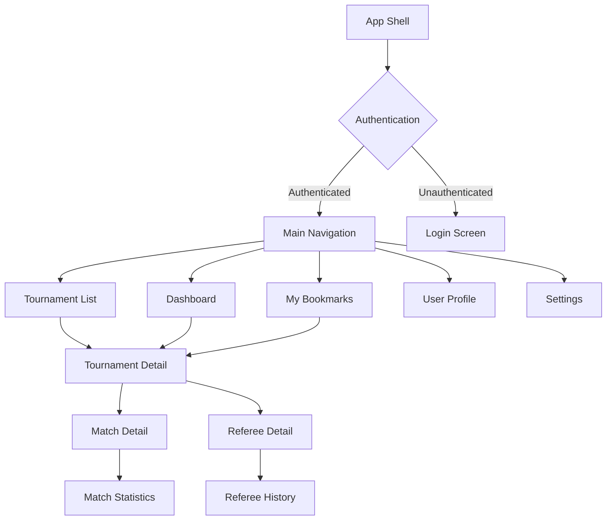
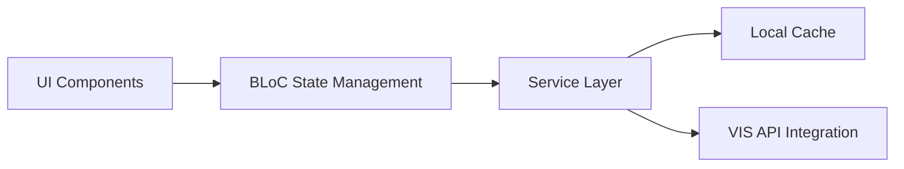

# BeachRef View Schema

## Overview
This document defines the complete view hierarchy and component structure for the BeachRef application, integrating UI requirements from the PRD with the technical architecture specifications.

## View Hierarchy

## Core Views

### 1. Authentication Flow

#### 1.1 Login Screen
**Route:** `/login`  
**Purpose:** FIVB credential authentication via Google OAuth  
**Data Dependencies:** AuthenticationService  
**Components:**
- FIVB branding header
- Google OAuth sign-in button
- Terms of service links
- Loading state indicator

**Functional Requirements:** FR6 (authentication integration)  
**Non-Functional Requirements:** NFR4 (HTTPS/TLS encryption)

#### 1.2 App Shell
**Route:** `/`  
**Purpose:** Main application container with navigation  
**Data Dependencies:** UserProfile, NotificationService  
**Components:**
- Top navigation bar with user avatar
- Main content area
- Navigation drawer (mobile)
- Notification banner
- Offline indicator

### 2. Dashboard Views

#### 2.1 Dashboard
**Route:** `/dashboard`  
**Purpose:** Personalized referee assignment overview  
**Data Dependencies:** Tournament, RefereeAssignment, UserProfile  
**Components:**
- Welcome header with user name
- Upcoming assignments card
- Recent tournaments widget
- Quick action buttons (search, bookmarks)
- Sync status indicator

**Functional Requirements:** FR7 (dashboard with relevant tournaments)  
**Performance:** NFR1 (3-second load time)

#### 2.2 Tournament List
**Route:** `/tournaments`  
**Purpose:** Filterable master list of all tournaments  
**Data Dependencies:** Tournament, CacheManager  
**Components:**
- Advanced filter panel
  - Date range picker
  - Location dropdown
  - Competition level selector
  - Tournament type filter
- Sortable data table
  - Tournament name
  - Dates
  - Location
  - Status badge
  - Quick actions (bookmark, view)
- Pagination controls
- Export button

**Functional Requirements:** FR2 (filtering), FR6 (search), FR8 (bookmarking)  
**Performance:** NFR2 (responsive design), NFR8 (optimized queries)

### 3. Tournament Detail Views

#### 3.1 Tournament Detail
**Route:** `/tournaments/:id`  
**Purpose:** Comprehensive single tournament view  
**Data Dependencies:** Tournament, Match, RefereeAssignment  
**Components:**
- Tournament header
  - Name, dates, location
  - Status indicator
  - Bookmark toggle
  - Export actions
- Tournament information panel
  - Format details
  - Participating teams
  - Venue information
- Match schedule table
  - Date/time
  - Court assignments
  - Team matchups
  - Status indicators
- Referee assignments section
  - Assignment list
  - Contact information
  - Roles and responsibilities

**Functional Requirements:** FR3 (tournament info), FR9 (match schedules), FR5 (referee info)  
**Performance:** NFR1 (3-second load time)

#### 3.2 Match Detail
**Route:** `/tournaments/:tournamentId/matches/:matchId`  
**Purpose:** Detailed match information and results  
**Data Dependencies:** Match, MatchStatistics, RefereeAssignment  
**Components:**
- Match header
  - Teams, date, court
  - Status badge
  - Duration indicator
- Score display
  - Final score (if completed)
  - Set-by-set breakdown
  - Visual score timeline
- Match statistics panel
  - Points breakdown
  - Service statistics
  - Attack/block stats
- Referee information
  - First referee details
  - Second referee details
  - Other officials
- Export options

**Functional Requirements:** FR4 (match results and statistics)

#### 3.3 Referee Detail
**Route:** `/referees/:id`  
**Purpose:** Individual referee profile and assignment history  
**Data Dependencies:** RefereeAssignment, UserProfile  
**Components:**
- Referee profile header
  - Name, certification level
  - Contact information
  - Photo (if available)
- Current assignments
  - Active tournaments
  - Upcoming matches
- Assignment history
  - Past tournaments
  - Performance metrics
  - Filterable timeline

**Functional Requirements:** FR5 (referee information display)

### 4. User Management Views

#### 4.1 My Bookmarks
**Route:** `/bookmarks`  
**Purpose:** User's saved tournaments for quick access  
**Data Dependencies:** UserBookmark, Tournament  
**Components:**
- Bookmarked tournaments list
- Priority sorting controls
- Personal notes display
- Reminder settings toggle
- Quick unbookmark actions

**Functional Requirements:** FR8 (bookmark functionality)

#### 4.2 User Profile
**Route:** `/profile`  
**Purpose:** User account and preference management  
**Data Dependencies:** UserProfile, NotificationSettings  
**Components:**
- Profile information display
- Preference settings
  - Default location
  - Competition level filters
  - Timezone settings
- Notification preferences
- Account actions (sign out)

#### 4.3 Settings
**Route:** `/settings`  
**Purpose:** Application configuration and data management  
**Data Dependencies:** UserProfile, CacheMetadata  
**Components:**
- Export settings
  - Default format (PDF/CSV)
  - Export template options
- Cache management
  - Storage usage display
  - Clear cache options
- Sync preferences
  - Background sync toggle
  - Sync frequency settings
- About/help sections

**Functional Requirements:** FR10 (export functionality)

## Shared Components

### Navigation Components
- **TopNavigationBar:** User avatar, notifications, search
- **SideDrawer:** Main navigation (mobile)
- **BreadcrumbTrail:** Hierarchical navigation context

### Data Display Components
- **TournamentCard:** Reusable tournament summary display
- **MatchCard:** Match information summary
- **DataTable:** Generic sortable/filterable table
- **FilterPanel:** Advanced filtering controls
- **StatusBadge:** Visual status indicators

### Action Components
- **BookmarkButton:** Toggle bookmark state
- **ExportButton:** Data export with format options
- **ShareButton:** Share tournament/match information
- **RefreshButton:** Manual sync trigger

### Utility Components
- **LoadingSpinner:** Async operation feedback
- **ErrorBoundary:** Error state handling
- **OfflineIndicator:** Network status display
- **SyncStatusIndicator:** Background sync feedback

## State Management

### BLoC Architecture
Each view maintains state through dedicated BLoC classes:

- **AuthBloc:** Authentication state and user session
- **TournamentBloc:** Tournament data and filtering
- **MatchBloc:** Match details and results
- **BookmarkBloc:** User bookmark management
- **SettingsBloc:** User preferences and configuration
- **SyncBloc:** Background synchronization status

### Data Flow

## Responsive Design Breakpoints

### Desktop (≥1024px)
- Full sidebar navigation
- Multi-column layouts
- Expanded data tables
- Side-by-side detail panels

### Tablet (768px - 1023px)
- Collapsible sidebar
- Stacked layouts
- Scrollable tables
- Modal detail views

### Mobile (≤767px)
- Bottom tab navigation
- Single column layouts
- Card-based displays
- Full-screen modals

## Accessibility Compliance (WCAG 2.1 AA)

### Keyboard Navigation
- Tab order follows logical flow
- All interactive elements accessible via keyboard
- Skip links for main content areas
- Focus indicators clearly visible

### Screen Reader Support
- Semantic HTML structure
- ARIA labels for complex components
- Live regions for dynamic updates
- Alternative text for all images

### Visual Accessibility
- Color contrast ratios ≥4.5:1
- Color not sole indicator of information
- Scalable text up to 200%
- High contrast mode support

## Performance Considerations

### Lazy Loading
- Route-based code splitting
- Image lazy loading
- Infinite scroll for large lists
- Progressive data loading

### Caching Strategy
- Service worker for offline capability
- Local storage for user preferences
- SQLite cache for tournament data
- Optimistic UI updates

### Optimization Targets
- First Contentful Paint: <2s
- Time to Interactive: <3s
- Largest Contentful Paint: <2.5s
- Cumulative Layout Shift: <0.1

## Integration Points

### External Services
- **Google OAuth:** User authentication
- **FIVB VIS API:** Tournament data source
- **Firebase Messaging:** Push notifications
- **Export Services:** PDF/CSV generation

### Internal Services
- **AuthenticationService:** Session management
- **CacheManager:** Local data storage
- **VISIntegrationService:** API communication
- **NotificationService:** User alerts
- **DataSyncCoordinator:** Background synchronization

This view schema provides a comprehensive mapping of all user interfaces required for the BeachRef application, ensuring alignment with both functional requirements and technical architecture specifications.